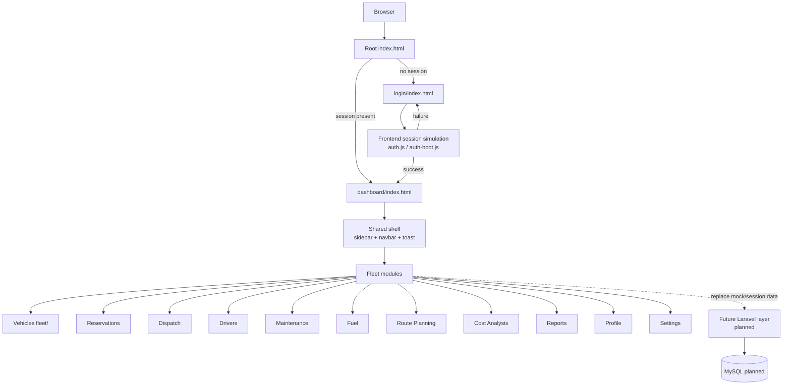
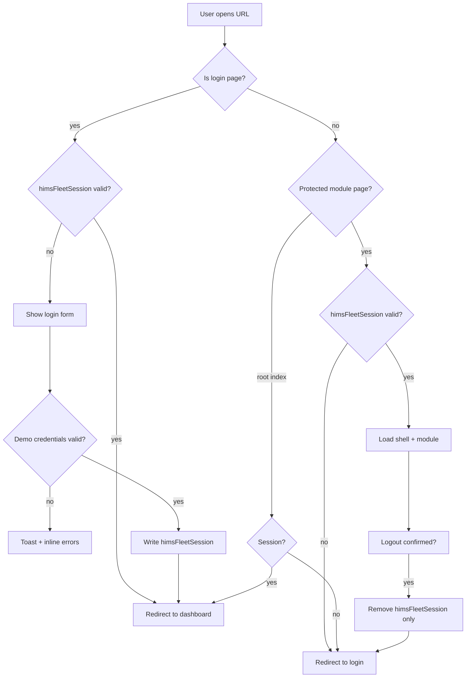
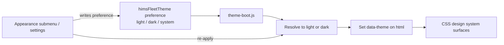
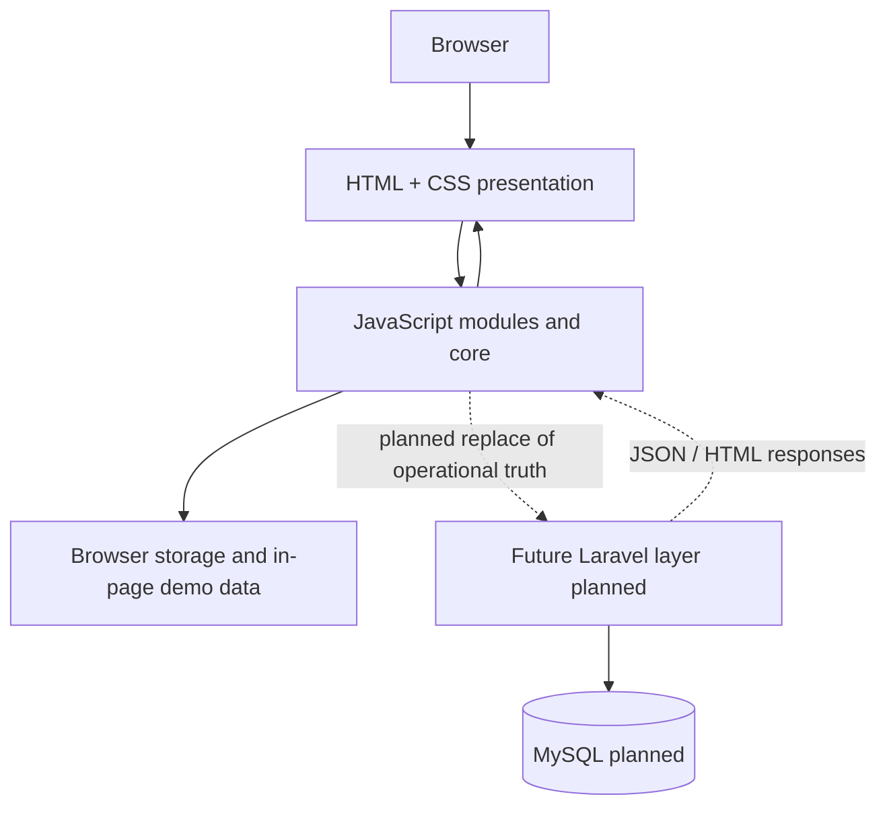

# Project Architecture

## Fleet & Transportation Management Module

**Hospital Information Management System (HIMS)**

| Field | Value |
| ----- | ----- |
| **Module** | Fleet & Transportation Management |
| **Document purpose** | Architectural blueprint for maintainers and Laravel integrators |
| **Frontend version** | Unversioned |
| **Structure freeze** | 1.0 — [docs/03-FOLDER-STRUCTURE.md](./03-FOLDER-STRUCTURE.md) |
| **Depends on** | [00-START-HERE.md](./00-START-HERE.md), [01-PROJECT-OVERVIEW.md](./01-PROJECT-OVERVIEW.md), [02-TECH-STACK.md](./02-TECH-STACK.md) |

---

## 1. Architecture Overview

The Fleet frontend is a **static, multi-page application** organized as a modular hospital operations UI.

It is:

| Characteristic | Meaning in this repository |
| -------------- | -------------------------- |
| **Component-based** | Shared shell fragments (sidebar, navbar, toast) and domain modals live under `components/` and are loaded into host pages |
| **Modular** | Each business area has a canonical page folder and a matching JavaScript module folder |
| **Shared-resource oriented** | One CSS entry (`assets/css/style.css`), shared core scripts, shared icons/Bootstrap CDNs |
| **Presentation-focused** | HTML/CSS/JS own layout, interaction, and feedback states |
| **Backend-independent** | Runs without Laravel today using demo data, sample analytics, and browser storage where implemented |

**Integration principle.** Laravel becomes the **data, authentication, authorization, and validation** layer. The frontend presentation architecture remains the reference UI unless a formal Breaking or Integrative change is approved under the structure freeze.

---

## 2. High-Level Architecture



**Notes**

- Protected module pages also load the shell via `include.js` (not only the dashboard).
- Dashed edge to Laravel indicates **planned** ownership of data and real auth, not code present in this repository.

---

## 3. Application Layers

| Layer | Location (typical) | Responsibility |
| ----- | ------------------ | -------------- |
| **Presentation layer** | `*/index.html`, `assets/css/**` | Markup, layout, visual design, responsive rules |
| **Shared component layer** | `components/**`, `assets/js/components/**` | Reusable shell and control behavior (sidebar, navbar, dropdown) |
| **Theme layer** | `theme-boot.js`, theme controls in `main.js`, CSS tokens | Preference resolution and `data-theme` application |
| **Frontend state layer** | `localStorage` / `sessionStorage`, in-page data models | Temporary session, preferences, selected client datasets |
| **Authentication layer (UI)** | `login/`, `auth.js`, `auth-boot.js`, `auth/login.js` | Demo login, session simulation, client redirects |
| **Business module layer** | `assets/js/<module>/`, module pages | Domain CRUD UX, filters, export, stats, modals |
| **Future Laravel layer** | Outside this repo (planned) | Real auth, validation, business rules, APIs/controllers |
| **Database layer** | MySQL (planned) | Durable system of record |

### Layer interaction (conceptual)

1. Presentation renders structure and styles.  
2. Shared components assemble the app shell.  
3. Auth layer decides whether the user may remain on a protected page.  
4. Module layer binds tables, forms, and actions.  
5. State layer holds temporary client data.  
6. Future Laravel + MySQL replace state-backed operational truth and demo auth.

---

## 4. Component Architecture

### Shell components

| Component | Source | Role |
| --------- | ------ | ---- |
| Sidebar | `components/shared/sidebar.html` + shell logic in `main.js` | Primary navigation, brand, profile menu, appearance submenu, logout |
| Navbar | `components/shared/navbar.html` + `assets/js/components/navbar.js` | Top bar, search/notifications/messages presentation, responsive menu toggle |
| Toast host | `components/shared/toast.html` + `assets/js/core/toast.js` | Global feedback messages |

Loaded by `assets/js/core/include.js` into markers such as `#sidebar`, `#navbar`, and toast containers on protected pages.

### Shared visual building blocks (CSS)

Defined under `assets/css/components/` and reused across modules:

| Building block | Role |
| -------------- | ---- |
| Cards | Section containers, stats, analytics panels |
| Toolbar | List actions (add, export, filters) |
| Tables | Data grids |
| Pagination | Page controls for visible rows |
| Forms | Inputs, labels, validation presentation classes |
| Modals | Overlay chrome and structure |
| Dropdown | Menus (export, appearance, profile) |
| Badges / buttons / search / skeleton | Status and control primitives |

### Domain modals (HTML fragments)

Under `components/<domain>/` for vehicle, reservation, dispatch, driver, maintenance, and fuel:

- add / edit / view / delete modal markup  
- loaded into page hosts; behavior owned by module JS  

### Cross-cutting UI surfaces

| Surface | Architecture note |
| ------- | ------------------ |
| Profile | Page `profile/` + `user-profile.js` + sidebar identity sync |
| Settings | Page `settings/` + settings store/scripts; appearance shares theme key |
| Notifications / Messages | Navbar presentation layer; not a full backend messaging system |
| Theme | Centralized; not reimplemented per module |
| Authentication | Centralized session API; login page is shell-free |

### Reuse rules

- Do not copy sidebar/navbar markup into each page.  
- Do not create parallel button/card/modal systems.  
- Module pages compose shared CSS classes + domain modals + module scripts only.

---

## 5. Module Architecture

Canonical HTML routes live in page folders. Script ownership lives under `assets/js/<name>/` (Vehicles exception: page `fleet/`, scripts `vehicle/`).

| Module | Page path | Purpose | Shared dependencies | Expected Laravel responsibility (general) |
| ------ | --------- | ------- | ------------------- | ----------------------------------------- |
| Dashboard | `dashboard/` | Operational overview and navigation shortcuts | Shell, theme, auth, toast | Aggregate metrics and activity feeds |
| Vehicles | `fleet/` | Fleet inventory CRUD UX | Shell, vehicle modals, table/toolbar CSS, export CDNs as used | Vehicle resource persistence and validation |
| Reservations | `reservation/` | Reservation lifecycle UI | Shell, reservation modals, list tooling | Reservation resource and workflow rules |
| Dispatch | `dispatch/` | Trip/dispatch coordination UI | Shell, dispatch modals, filters | Dispatch assignments and status rules |
| Drivers | `driver/` | Driver roster UI | Shell, driver modals | Driver resource and credentials fields |
| Maintenance | `maintenance/` | Maintenance records UI | Shell, maintenance modals, stats | Work orders and costs |
| Fuel Management | `fuel/` | Fuel logs UI | Shell, fuel modals, stats | Fuel transactions and costs |
| Route Planning | `route-planning/` | Routes and templates UI | Shell, route scripts/storage | Route entities and templates |
| Cost Analysis | `cost-analysis/` | Cost charts, tables, budgets | Shell, cost scripts, sample/storage reads | Authoritative cost queries and budgets |
| Reports | `reports/` | Multi-view analytics | Shell, report scripts, sample/storage reads | Server-side report datasets |
| Profile | `profile/` | User profile presentation | Shell, `user-profile.js` | Authenticated user profile |
| Settings | `settings/` | Fleet unit preferences | Shell, settings store, shared theme | Persisted unit configuration |

**Do not invent concrete REST paths.** When APIs are designed, document them in a future API contract doc and wire module data access at clear seams without rewriting presentation.

### Module isolation

```text
Page HTML (route)
  → shared shell (include.js)
  → module scripts (assets/js/<module>/)
  → optional domain modals (components/<domain>/)
  → shared CSS (style.css)
```

Modules must not reimplement auth, theme boot, toast core, or shell navigation.

---

## 6. Authentication Architecture

### Current (frontend session simulation)

| Piece | Path / key | Behavior |
| ----- | ---------- | -------- |
| Login page | `login/index.html` | Standalone form; no sidebar/navbar |
| Login controller | `assets/js/auth/login.js` | Client validation, submit, toasts |
| Session API | `assets/js/core/auth.js` | `login`, `logout`, `isAuthenticated`, `requireAuth`, `getCurrentUser`, `performFleetLogout` |
| Early guard | `assets/js/core/auth-boot.js` | Head script redirects before full app paint |
| Session key | `himsFleetSession` | sessionStorage by default; localStorage if Remember me |
| Demo credentials | Defined in `auth.js` / shown on login page | Frontend only; not secure |
| Logout | Profile menu → confirm → clear session only → login | Preserves theme/profile/settings keys |

### Redirect flow



### Future (planned)

| Concern | Owner |
| ------- | ----- |
| Credential verification | Laravel (e.g. Breeze or approved auth stack) |
| Secure session / cookies | Laravel |
| Authorization | Laravel policies/roles |
| Login presentation | Frontend (retained) |
| Client guard as UX only | Frontend may keep soft redirects; **not** security |

---

## 7. Theme Architecture

| Concern | Implementation |
| ------- | -------------- |
| Preference key | `himsFleetTheme` in `localStorage` |
| Allowed preferences | `light`, `dark`, `system` |
| Resolved attribute | `document.documentElement` `data-theme` = `light` or `dark` |
| Early init | `assets/js/core/theme-boot.js` in `<head>` before CSS (avoids flash) |
| Interactive controls | `main.js` theme helpers + sidebar Appearance submenu |
| System resolution | `prefers-color-scheme` when preference is `system` |
| CSS application | Design tokens / component styles react to `data-theme` |
| Settings linkage | Settings UI cooperates with the same theme key (not a second theme system) |

### Theme flow



Theme presentation remains **frontend-owned** after Laravel integration. Optional server sync of preference is a future additive concern, not a redesign of the theme engine.

---

## 8. Data Flow

### Current and target flow



### Step explanation

| Step | Current | After Laravel integration |
| ---- | ------- | ------------------------- |
| Browser loads page | Static HTML over HTTP server | Same routes or approved Blade mapping |
| UI renders | Design system + components | Unchanged presentation contracts |
| JavaScript binds behavior | Module CRUD UX, filters, export | Same UX; data access points call backend |
| Client storage / samples | Session, theme, profile, settings, selected datasets | Theme/UX prefs may remain; operational data leaves browser as source of truth |
| Laravel | Not present | Auth, validation, business rules, queries |
| Database | Not present | Persistent records |

**Rule:** Do not delete a frontend fallback until its backend replacement is proven for that module.

---

## 9. Frontend Ownership (permanent presentation contract)

Owned by the frontend stack unless a formal redesign is approved:

- HTML structure and component fragments  
- CSS design system and Bootstrap usage  
- Icons (Phosphor) and visual motion  
- Shared shell components and modal presentation  
- Responsive layout  
- Theme engine and appearance presentation  
- Loading, empty, success, and error **presentation**  
- Client interaction patterns (tables, filters, dropdowns, toasts)  
- Client export rendering (until an approved server export replaces it)  
- Chart presentation code (data source may change)

---

## 10. Backend Ownership (Laravel / MySQL — planned)

Owned by the backend when integrated:

- Real authentication and secure sessions  
- Authorization and roles  
- Server-side validation  
- Business rules and workflows  
- Database persistence  
- Authoritative dashboard and report datasets  
- Notification data delivery  
- Audit logs  
- Security controls (CSRF, password hashing, access policy)  
- File storage  
- Server-side processing  

---

## 11. Integration Boundaries

| Boundary | Frontend side | Laravel begins when… |
| -------- | ------------- | -------------------- |
| **Authentication boundary** | `auth.js` API, login form, client redirects | Credentials are verified server-side; session cookie/token is authoritative |
| **Storage boundary** | `himsFleet*` keys and in-page demos | Module reads/writes go to validated backend resources |
| **Module boundary** | `assets/js/<module>/` UX remains | Each module’s data access is swapped independently |
| **API boundary** | Future shared client helper (not required to invent now) | Stable request/response contracts exist per resource |
| **Theme boundary** | `theme-boot.js` + CSS tokens | Optional preference sync only; do not fork a second theme system |
| **Component boundary** | `components/` + include pipeline | Blade may wrap layouts later; do not duplicate shell markup |

Laravel integration should attach **behind** these seams, not by rewriting the frozen folder tree.

---

## 12. Architectural Principles

| Principle | Application |
| --------- | ----------- |
| Single responsibility | Prefer one clear job per script/file |
| Separation of concerns | Presentation vs temporary state vs future server truth |
| Reusable components | Shell and design-system primitives shared by all modules |
| Centralized theme | One preference key, one early boot, one resolved attribute |
| Centralized auth API | One session utility for UI flow |
| Module isolation | Domain logic stays in module folders |
| Documentation first | Architecture and structure docs lead structural work |
| Frozen frontend | Paths and ownership locked under freeze 1.0 |
| Incremental integration | One domain at a time; verify routes after each step |

---

## 13. Safe Change Policy

Aligned with [docs/03-FOLDER-STRUCTURE.md](./03-FOLDER-STRUCTURE.md):

| Class | Meaning | Approval |
| ----- | ------- | -------- |
| **Additive** | New file without moving existing production files | Normal review |
| **Corrective** | Fix broken path or clear defect without redesign | Review; document if public paths change |
| **Integrative** | Laravel requires a structural accommodation | Maintainer approval + docs update |
| **Breaking** | Existing path or public frontend contract changes | Maintainer approval, full reference update, full module test, docs update |

**Before Breaking / Integrative path changes**

1. Identify every active reference.  
2. Update all affected paths.  
3. Test every module route.  
4. Update structure and architecture documentation.  
5. Obtain maintainer approval.

Unsafe patterns: parallel design systems, duplicate auth stacks, renaming `fleet/` vs `vehicle/` casually, mass Blade conversion without a plan.

---

## 14. Related Documentation

### Existing

| Document | Role |
| -------- | ---- |
| [docs/00-START-HERE.md](./00-START-HERE.md) | Handover, runbook, integration order |
| [docs/01-PROJECT-OVERVIEW.md](./01-PROJECT-OVERVIEW.md) | Product context and scope |
| [docs/02-TECH-STACK.md](./02-TECH-STACK.md) | Technology inventory |
| [docs/03-FOLDER-STRUCTURE.md](./03-FOLDER-STRUCTURE.md) | Frozen tree and path ownership |
| [docs/04-PROJECT-ARCHITECTURE.md](./04-PROJECT-ARCHITECTURE.md) | This architecture blueprint |
| [docs/design-system.md](./design-system.md) | UI design notes |
| [README.md](../README.md) | Repository intro |

### Complete documentation set (selected)

| Document | Role |
| -------- | ---- |
| [docs/07-JAVASCRIPT-ARCHITECTURE.md](./07-JAVASCRIPT-ARCHITECTURE.md) | Deep JS conventions |
| [docs/08-ROUTING.md](./08-ROUTING.md) | Route map and Laravel mapping |
| [docs/09-AUTHENTICATION.md](./09-AUTHENTICATION.md) | Auth architecture |
| [docs/11-MODULES.md](./11-MODULES.md) | Per-module deep dives |
| [docs/12-BACKEND-INTEGRATION.md](./12-BACKEND-INTEGRATION.md) | Integration playbook |
| [docs/13-DATABASE-MAPPING.md](./13-DATABASE-MAPPING.md) | Schema mapping |
| [docs/14-API-CONTRACT.md](./14-API-CONTRACT.md) | Frontend–backend communication |
| [docs/15-LOCAL-STORAGE.md](./15-LOCAL-STORAGE.md) | Storage migration |
| [docs/18-KNOWN-LIMITATIONS.md](./18-KNOWN-LIMITATIONS.md) | Limitations register |
| [docs/20-HANDOVER-CHECKLIST.md](./20-HANDOVER-CHECKLIST.md) | Sign-off checklist |
| [docs/21-ROLE-MATRIX.md](./21-ROLE-MATRIX.md) | Role matrix |
| [docs/22-DEPLOYMENT-ARCHITECTURE.md](./22-DEPLOYMENT-ARCHITECTURE.md) | Deployment architecture |
| [docs/23-HOSTING-INFRASTRUCTURE.md](./23-HOSTING-INFRASTRUCTURE.md) | Hosting infrastructure |

---

## 15. Final Recommendation

This document defines the official architecture of the Fleet & Transportation Management frontend.

Laravel integration must preserve this architecture while replacing only backend responsibilities.

Future architectural changes must be documented before implementation and must not violate the frozen frontend structure.

---

## Document control

| Field | Value |
| ----- | ----- |
| Path | `docs/04-PROJECT-ARCHITECTURE.md` |
| Type | Project architecture |
| Production code changes | None |
| Diagrams | High-level system, authentication redirects, theme flow, data flow |
