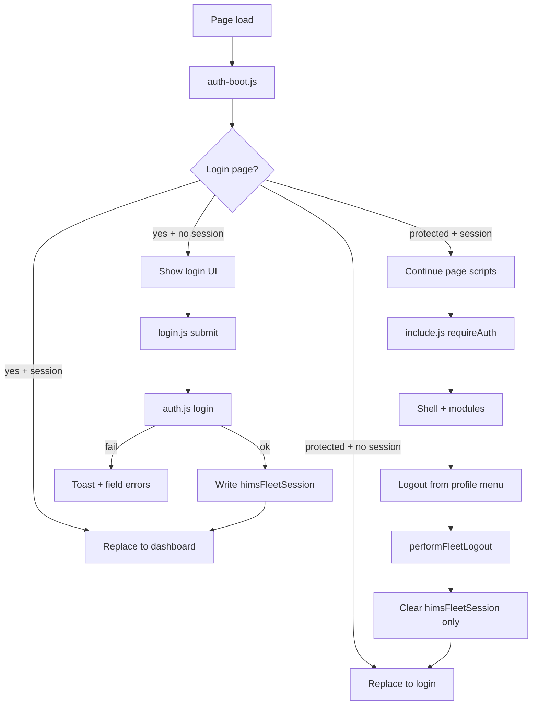
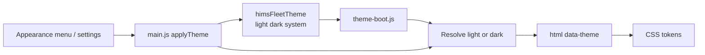
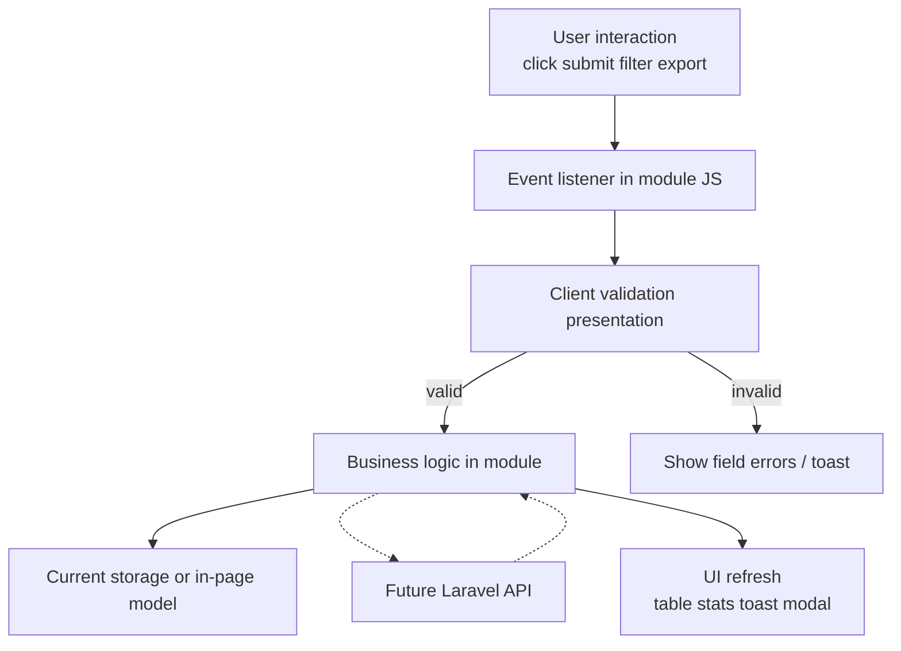
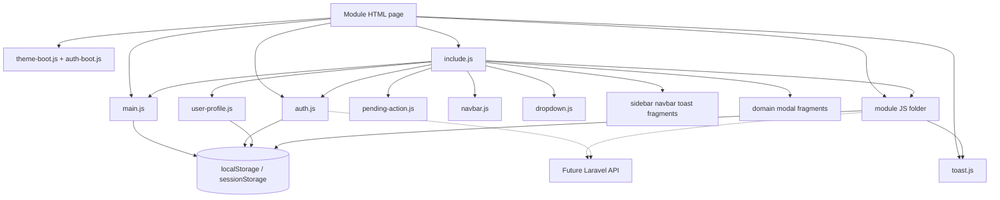

# JavaScript Architecture

## Fleet & Transportation Management Module

**Hospital Information Management System (HIMS)**

| Field | Value |
| ----- | ----- |
| **Document purpose** | Official JavaScript architecture reference for frontend and Laravel integrators |
| **Runtime model** | Multi-page app; plain ES6 scripts (no bundler, no SPA framework) |
| **Script count** | 110 files under `assets/js/` (verified inventory) |
| **Structure freeze** | 1.0 — [docs/03-FOLDER-STRUCTURE.md](./03-FOLDER-STRUCTURE.md) |
| **Related docs** | [04-PROJECT-ARCHITECTURE.md](./04-PROJECT-ARCHITECTURE.md), [06-COMPONENT-SYSTEM.md](./06-COMPONENT-SYSTEM.md), [05-DESIGN-SYSTEM.md](./05-DESIGN-SYSTEM.md) |

---

## 1. JavaScript Architecture Overview

The Fleet frontend JavaScript is organized as a **layered multi-page system**:

| Layer | Role |
| ----- | ---- |
| **Boot (head)** | Theme and auth gates before paint |
| **Core** | Shared session, shell, toast, includes, profile helpers |
| **Shared components JS** | Navbar interactions, export dropdowns |
| **Auth page** | Login form controller |
| **Modules** | Domain CRUD, filters, export, charts, settings |
| **CDN helpers** | Bootstrap JS, xlsx, jsPDF where a page includes them |

Interactions:

| Concern | JS involvement |
| ------- | -------------- |
| HTML | Scripts bind to existing IDs/classes; pages load ordered `<script>` tags |
| Components | `include.js` fetches HTML fragments; then init functions run |
| Theme | `theme-boot.js` + theme APIs in `main.js` |
| Authentication | `auth-boot.js` + `auth.js` + login controller |
| Storage | Browser keys for session/theme/profile/settings/selected datasets |
| Modules | Isolated folders; orchestrated by page scripts + `include.js` inits |
| Future Laravel APIs | Module data access and auth session seams become API consumers |

**Design intent:** Laravel replaces **data sources, authentication, and persistence**. Presentation modules evolve into API consumers rather than being rewritten.

There is **no** separate `theme.js` or `storage.js` file. Theme logic lives in `theme-boot.js` + `main.js`. Storage access is implemented inside the modules that need it.

---

## 2. Repository JS Structure

```text
assets/js/
├── auth/
│   └── login.js
├── components/
│   ├── dropdown.js
│   └── navbar.js
├── core/
│   ├── auth-boot.js
│   ├── auth.js
│   ├── include.js
│   ├── main.js
│   ├── pending-action.js
│   ├── theme-boot.js
│   ├── toast.js
│   └── user-profile.js
├── cost-analysis/          (8 files)
├── dashboard/
│   └── dashboard.js
├── dispatch/               (12 files)
├── driver/                 (13 files)
├── fuel/                   (12 files)
├── maintenance/            (12 files)
├── profile/
│   └── profile-page.js
├── reports/                (7 files)
├── reservation/            (12 files)
├── route-planning/         (5 files)
├── settings/               (2 files)
└── vehicle/                (14 files)
```

| Folder | Files | Page pairing |
| ------ | ----- | ------------ |
| `core/` | 8 | All protected pages + partial use on login |
| `components/` | 2 | Shell / list export menus |
| `auth/` | 1 | `login/index.html` |
| `dashboard/` | 1 | `dashboard/` |
| `vehicle/` | 14 | `fleet/` (naming split is frozen) |
| `reservation/` | 12 | `reservation/` |
| `dispatch/` | 12 | `dispatch/` |
| `driver/` | 13 | `driver/` |
| `maintenance/` | 12 | `maintenance/` |
| `fuel/` | 12 | `fuel/` |
| `route-planning/` | 5 | `route-planning/` |
| `cost-analysis/` | 8 | `cost-analysis/` |
| `reports/` | 7 | `reports/` |
| `settings/` | 2 | `settings/` |
| `profile/` | 1 | `profile/` |

---

## 3. Core Layer

### `assets/js/core/theme-boot.js`

| | |
| --- | --- |
| **When** | `<head>`, before CSS |
| **Role** | Read `himsFleetTheme`; resolve light/dark/system; set `document.documentElement` `data-theme` |
| **API** | IIFE only (no exports) |

### `assets/js/core/auth-boot.js`

| | |
| --- | --- |
| **When** | `<head>` after theme-boot |
| **Role** | Early gate on `himsFleetSession`; redirect unauthenticated users from app pages; reverse-redirect authenticated users from login |
| **API** | IIFE only |

### `assets/js/core/auth.js`

| Function | Role |
| -------- | ---- |
| `isAuthenticated()` | Session present and `authenticated === true` |
| `login(email, password, remember)` | Demo credential check; write session (no password storage) |
| `logout()` | Remove session key only |
| `requireAuth()` | Redirect to login if unauthenticated |
| `redirectIfAuthenticated()` | Login page → dashboard if already authed |
| `getCurrentUser()` | Read session user fields |
| `performFleetLogout()` | Confirm + logout + redirect |
| Path helpers | `getAuthLoginPath()`, `getAuthDashboardPath()`, `isLoginPage()` |

Key: `himsFleetSession`.

### `assets/js/core/include.js`

| Function | Role |
| -------- | ---- |
| `loadComponent(id, file)` | `fetch` HTML into host element |
| `loadSharedScriptOnce(src)` | Idempotent script inject |
| `DOMContentLoaded` handler | Auth require → load shell scripts/components → init shell → load modals → call module inits |

### `assets/js/core/main.js`

Shell and theme runtime:

| Area | Functions (representative) |
| ---- | -------------------------- |
| Nav active state | `initializePage()` |
| Desktop collapse | `initDesktopSidebarCollapse()`, preference `himsFleetSidebarCollapsed` |
| Collapsed tooltips | `initSidebarCollapsedTooltips()` |
| Theme | `getThemePreference()`, `getResolvedTheme()`, `getSavedTheme()`, `applyTheme()`, `syncThemeMenuState()`, `initThemeControls()`, `initSystemThemeListener()`, `applyEarlyTheme()` |
| Profile menu | `initSidebarProfileDropdown()` (profile/settings/help/logout + appearance) |
| Responsive shell | `initResponsiveNavigation()` |

Theme key: `himsFleetTheme`.

### `assets/js/core/toast.js`

| Function | Role |
| -------- | ---- |
| `ensureToastContainer()` | Ensure toast host DOM |
| `initToast()` | Bind toast system |
| `showToast(message, type)` | Display toast (`success`, `error`, `warning`, `info` as used by callers) |

### `assets/js/core/user-profile.js`

| Function | Role |
| -------- | ---- |
| `getUserProfile()` / `saveUserProfile()` | Profile record |
| `syncUserProfileUI()` | Sidebar/profile name, role, initials |
| Key | `himsFleetUserProfile` |

### `assets/js/core/pending-action.js`

Cross-page action handoff:

| Function | Role |
| -------- | ---- |
| `setPendingFleetAction` / `peekPendingFleetAction` / `clearPendingFleetAction` | Store short-lived action |
| `consumePendingFleetAction(handlers)` | Run handler on target page |
| `navigateWithPendingFleetAction(url, action, payload)` | Navigate with pending payload |
| Key | `himsFleetPendingAction` (max age ~60s) |

---

## 4. Shared Initialization

### Typical protected page head

1. Phosphor CDN  
2. `theme-boot.js`  
3. `auth-boot.js`  
4. `style.css`  

### Typical protected page body scripts (order varies slightly by module)

1. `include.js` (registers `DOMContentLoaded`)  
2. `toast.js`  
3. `auth.js`  
4. `main.js`  
5. Optional: `pending-action.js`, `dropdown.js`, CDN export libs  
6. Module scripts  
7. Optional Bootstrap bundle  

### `include.js` DOMContentLoaded flow (verified sequence)

```text
loadSharedScriptOnce(auth.js)
requireAuth() → stop if redirecting
loadSharedScriptOnce(pending-action.js)
loadSharedScriptOnce(user-profile.js)
loadSharedScriptOnce(navbar.js)
loadComponent(sidebar)
initializePage()
syncUserProfileUI()
initSidebarProfileDropdown()
initThemeControls()
initDesktopSidebarCollapse()
initSidebarCollapsedTooltips()
initExportDropdowns()
loadComponent(navbar)
initResponsiveNavigation()
initNavbarInteractions()
initDashboardPage() if present
load domain modals if host IDs exist
load toast fragment if #toast exists
call module init* functions (vehicle, driver, reservation, …)
initToast()
```

### Login page flow

- Head: theme-boot + auth-boot  
- Body: auth.js, toast.js, main.js (theme helpers), `auth/login.js`  
- **No** `include.js` shell load  
- `initLoginPage()` validates form → `login()` → redirect dashboard  

### Authentication initialization

| Stage | Script |
| ----- | ------ |
| Pre-paint redirect | `auth-boot.js` |
| Session API available | `auth.js` (script tag and/or include loader) |
| Secondary gate | `requireAuth()` inside include |
| Login UI | `login.js` |

### Theme initialization

| Stage | Script |
| ----- | ------ |
| Pre-paint | `theme-boot.js` |
| Interactive controls | `initThemeControls()` after sidebar loaded |
| System preference listener | `initSystemThemeListener()` via theme apply path |

### Navigation initialization

| Concern | Function |
| ------- | -------- |
| Active link | `initializePage()` |
| Collapse | `initDesktopSidebarCollapse()` |
| Mobile drawer | `initResponsiveNavigation()` |
| Navbar search/actions | `initNavbarInteractions()` |

---

## 5. Authentication Flow

### Current — frontend session simulation



| Item | Detail |
| ---- | ------ |
| Session key | `himsFleetSession` |
| Remember me | `localStorage` if checked; else `sessionStorage` |
| Password storage | **Never** stored |
| Demo credentials | Defined in `auth.js`; shown on login page |
| Security | **Not secure** — UI simulation only |

### Future — Laravel Breeze (or approved Laravel auth)

| Remain frontend | Move to Laravel |
| --------------- | --------------- |
| Login form presentation | Credential verification |
| Error display / redirect UX | Secure session cookies |
| Soft client redirects (optional UX) | Authorization, CSRF, password policy |

Primary seam: **`assets/js/core/auth.js`** (and head `auth-boot.js` behavior).

---

## 6. Theme Flow



| Concern | Implementation |
| ------- | -------------- |
| Preference key | `himsFleetTheme` |
| Allowed values | `light`, `dark`, `system` |
| Applied attribute | `data-theme="light"` or `"dark"` |
| Early boot | `theme-boot.js` |
| Runtime API | `getThemePreference`, `getResolvedTheme`, `getSavedTheme`, `applyTheme`, `syncThemeMenuState` |
| UI surfaces | Sidebar appearance submenu; settings theme fields share the same key |
| System mode | `prefers-color-scheme` via `getSystemTheme()` / media listener |

Do not introduce a second theme engine.

---

## 7. Storage Layer

### Mechanisms

| API | Typical use |
| --- | ----------- |
| `sessionStorage` | Default auth session when Remember me is off |
| `localStorage` | Remembered session, theme, profile, settings, module preferences, optional operational keys |

### Verified keys

| Key | Owner scripts | Laravel direction |
| --- | ------------- | ----------------- |
| `himsFleetSession` | `auth.js`, `auth-boot.js` | **Replace** with server session |
| `himsFleetTheme` | `theme-boot.js`, `main.js`, settings | Frontend presentation; optional server sync |
| `himsFleetSidebarCollapsed` | `main.js` | Frontend UX preference |
| `himsFleetPendingAction` | `pending-action.js` | Frontend navigation helper or redesign with routes |
| `himsFleetUserProfile` | `user-profile.js` | **Replace** with auth user profile |
| `himsFleetSettings` | `settings-store.js` | **Replace** with persisted settings |
| `himsFleetRoutes` | `route-store.js` | **Replace** with DB |
| `himsFleetRouteTemplates` | `route-store.js` | **Replace** with DB |
| `himsFleetCostAnalysisBudget` | `cost-budget.js` | **Replace** with DB |
| `himsFleetCostAnalysisBudgetHistory` | `cost-budget.js` | **Replace** with DB |
| `himsFleetCostAnalysisPresets` | `cost-presets.js` | **Replace** with DB |
| `himsFleetReportPresets` | `reports-presets.js` | **Replace** with DB |
| `himsFleetVehicles` | Optional reads: reports/cost/navbar | **Replace** with vehicle API |
| `himsFleetDrivers` | Optional reads | **Replace** with drivers API |
| `himsFleetReservations` | Optional reads | **Replace** with reservations API |
| `himsFleetDispatches` | Optional reads | **Replace** with dispatch API |
| `himsFleetMaintenance` | Optional reads | **Replace** with maintenance API |
| `himsFleetFuel` | Optional reads | **Replace** with fuel API |

Many CRUD modules primarily operate on **in-page / demo table models** even when analytics optionally read localStorage. Treat browser storage as temporary, not the enterprise system of record.

---

## 8. Module Layer

For each module: purpose, JS files, dependencies, and **general** future API ownership (no invented endpoints).

### Dashboard

| | |
| --- | --- |
| **Purpose** | Overview navigation and static/sample KPI presentation |
| **JS** | `assets/js/dashboard/dashboard.js` |
| **Dependencies** | Shell (`include`, `main`, auth, toast); optional pending-action |
| **Future API** | Aggregate metrics and activity feeds |

### Vehicles (`fleet/` page)

| | |
| --- | --- |
| **Purpose** | Vehicle inventory CRUD UX |
| **JS** | `vehicle-modal`, `vehicle-form`, `vehicle-image`, `vehicle-add`, `vehicle-bulk`, `vehicle-filters`, `vehicle-pagination`, `vehicle-sort`, `vehicle-export`, `vehicle-print`, `vehicle-stats`, `vehicle-view`, `vehicle-edit`, `vehicle-delete` |
| **Dependencies** | Shell, dropdown export, toast, xlsx/jspdf CDNs when present, vehicle modals via include |
| **Future API** | Vehicle resource CRUD, images, filters/pagination server-side |

### Reservations

| | |
| --- | --- |
| **Purpose** | Reservation lifecycle UI |
| **JS** | `reservation-modal`, add/edit/view/delete, bulk, filter, pagination, sort, export, print, stats |
| **Dependencies** | Shell, dropdown, toast, modals |
| **Future API** | Reservation workflow and validation |

### Dispatch

| | |
| --- | --- |
| **Purpose** | Dispatch coordination UI |
| **JS** | `dispatch-modal`, add/edit/view/delete, bulk, filter, pagination, sort, export, print, stats |
| **Dependencies** | Shell, dropdown, toast, modals |
| **Future API** | Dispatch assignment and status transitions |

### Drivers

| | |
| --- | --- |
| **Purpose** | Driver roster UI |
| **JS** | `driver.js` + add/edit/view/delete, bulk, filter, search, pagination, sort, export, print, stats |
| **Dependencies** | Shell, dropdown, toast, modals |
| **Future API** | Driver resource CRUD |

### Maintenance

| | |
| --- | --- |
| **Purpose** | Maintenance records UI |
| **JS** | `maintenance-modal`, add/edit/view/delete, bulk, search, pagination, sort, export, print, statistics |
| **Dependencies** | Shell, dropdown, toast, modals |
| **Future API** | Work orders and costs |

### Fuel

| | |
| --- | --- |
| **Purpose** | Fuel logs UI |
| **JS** | `fuel-modal`, add/edit/view/delete, bulk, search, pagination, sort, export, print, statistics |
| **Dependencies** | Shell, dropdown, toast, modals |
| **Future API** | Fuel transactions |

### Route Planning

| | |
| --- | --- |
| **Purpose** | Routes and templates |
| **JS** | `route-store`, `route-modal`, `route-pipeline`, `route-templates`, `route-export` |
| **Dependencies** | Shell, toast; storage keys for routes/templates |
| **Future API** | Route entities and templates |

### Cost Analysis

| | |
| --- | --- |
| **Purpose** | Cost charts, tables, budgets, presets |
| **JS** | `cost-init`, `cost-data`, `cost-pipeline`, `cost-charts`, `cost-table`, `cost-budget`, `cost-presets`, `cost-export` |
| **Dependencies** | Shell; optional localStorage operational keys + sample fallbacks |
| **Future API** | Authoritative cost aggregates and budgets |

### Reports

| | |
| --- | --- |
| **Purpose** | Multi-view analytics |
| **JS** | `reports.js`, `reports-data`, `reports-pipeline`, `reports-charts`, `reports-table`, `reports-presets`, `reports-export` |
| **Dependencies** | Shell; sample/storage-backed datasets |
| **Future API** | Server report queries |

### Settings

| | |
| --- | --- |
| **Purpose** | Fleet unit preferences, import/export settings, theme linkage |
| **JS** | `settings-store.js`, `settings.js` |
| **Dependencies** | Shell, toast, `himsFleetSettings` / theme key |
| **Future API** | Persisted unit configuration |

### Profile

| | |
| --- | --- |
| **Purpose** | User profile presentation and edit |
| **JS** | `profile/profile-page.js` + shared `user-profile.js` |
| **Dependencies** | Shell, toast, profile storage |
| **Future API** | Authenticated user profile |

### Login (auth page)

| | |
| --- | --- |
| **Purpose** | Sign-in UX |
| **JS** | `auth/login.js` + `core/auth.js` |
| **Dependencies** | Toast; theme boot; no include shell |
| **Future API** | Laravel login endpoint / session |

---

## 9. Event Flow

Typical module action (e.g. save vehicle, filter table, export):



| Step | Current | After Laravel |
| ---- | ------- | ------------- |
| Listener | Module `init*` binds once | Unchanged presentation hooks |
| Validation | Client UX validation | Server validation authoritative; client keeps UX checks |
| Business logic | Module JS | Keep orchestration; move rules server-side |
| Persistence | In-page / localStorage | HTTP API + DB |
| UI refresh | Re-render rows/stats/toast | Same after API success/error |

---

## 10. Shared Utilities

There is **no** single `utils/` folder in the cleaned tree. Shared behavior lives in core/components and repeated module patterns.

| Utility concern | Actual location |
| --------------- | --------------- |
| Toast | `core/toast.js` → `showToast` |
| Modal open/close / populate | Module `*-modal.js` + shared modal CSS/HTML fragments |
| Pagination | Per-module `*-pagination.js` + shared pagination CSS |
| Export (Excel/PDF/Print) | Per-module `*-export.js` / `*-print.js` + CDN libs; menus via `components/dropdown.js` |
| Search | Module search/filter scripts; global search in `components/navbar.js` |
| Filters | Module `*-filter.js` / `vehicle-filters.js` etc. |
| Dropdown (export) | `components/dropdown.js` → `initExportDropdowns` |
| Loading | CSS skeleton + button `.is-loading`; module-specific busy flags |
| Confirmation | Delete modals; logout `confirmFleetLogout()` |
| Component include | `include.js` |
| Pending navigation actions | `pending-action.js` |
| Profile sync | `user-profile.js` |

Do not invent a non-existent global `modal.js` / `storage.js` utility file.

---

## 11. Dependency Diagram



CDN scripts (Bootstrap, xlsx, jsPDF) attach only where pages include them; they are not core architecture.

---

## 12. Role Awareness

Role-based UI is **not enforced** by current JavaScript authorization checks.

| Guidance | Detail |
| -------- | ------ |
| Reference | [docs/21-ROLE-MATRIX.md](./21-ROLE-MATRIX.md) (User Role Matrix) |
| Future UI | Optionally hide nav items/actions client-side for UX |
| Server truth | Laravel policies, gates, middleware, validation |
| Demo identity | Session/profile default label **Fleet Administrator** |

Do not implement security solely in JS visibility helpers.

---

## 13. Laravel Integration Boundary

### JavaScript that should remain (presentation / orchestration)

| Area | Files / patterns |
| ---- | ---------------- |
| Shell behavior | `main.js`, `include.js`, `navbar.js`, `dropdown.js` |
| Theme presentation | `theme-boot.js`, theme functions in `main.js` |
| Toast / UX feedback | `toast.js` |
| Modal UX lifecycle | Module modal controllers + HTML fragments |
| Table interaction UX | Filter/sort/pagination **presentation** (may call APIs for data) |
| Chart rendering | `reports-charts.js`, `cost-charts.js` (data source changes) |
| Login form UX | `login.js` markup binding |

### JavaScript that becomes API-driven (data/auth seams)

| Area | Current | Target |
| ---- | ------- | ------ |
| Session login/logout | `auth.js` demo session | Laravel session/cookie auth client |
| Early gate | `auth-boot.js` | Align with real auth state (cookie/session check or server-rendered) |
| CRUD persistence | Module add/edit/delete + in-page models | REST/web endpoints |
| Profile/settings stores | localStorage keys | Authenticated API |
| Route/cost/report stores | localStorage + samples | Server queries |
| Optional operational keys | `himsFleetVehicles` etc. | API list endpoints |
| Export datasets | DOM/local models | Optional server export later |

### Integration strategy

1. Keep init function names and DOM contracts.  
2. Swap internal data loaders to `fetch`/axios (or form posts) behind small helpers.  
3. Map 422 errors to existing validation UI.  
4. Remove mock fallbacks only after API success is proven per module.

---

## 14. Best Practices

1. Prefer **event delegation** and single init guards (many modules already use init flags).  
2. Use `const` by default; `let` only when reassignment is required (project convention).  
3. Do not duplicate auth, theme, toast, or export-dropdown utilities.  
4. Keep module logic inside `assets/js/<module>/`.  
5. Do not create `file-v2.js` / `file-final.js` forks.  
6. Do not put secrets in JavaScript.  
7. Do not treat client guards as security.  
8. Load pages over HTTP so `include.js` fetch works.  
9. After structural path changes, update every script `src` and document under freeze change control.  
10. Evolve modules into API consumers; avoid full rewrites of working UX.

---

## 15. Related Documentation

| Document | Status | Purpose |
| -------- | ------ | ------- |
| [docs/00-START-HERE.md](./00-START-HERE.md) | Existing | Handover and integration order |
| [docs/01-PROJECT-OVERVIEW.md](./01-PROJECT-OVERVIEW.md) | Existing | Product context |
| [docs/02-TECH-STACK.md](./02-TECH-STACK.md) | Existing | Technologies |
| [docs/03-FOLDER-STRUCTURE.md](./03-FOLDER-STRUCTURE.md) | Existing | Frozen paths |
| [docs/04-PROJECT-ARCHITECTURE.md](./04-PROJECT-ARCHITECTURE.md) | Existing | System architecture |
| [docs/05-DESIGN-SYSTEM.md](./05-DESIGN-SYSTEM.md) | Existing | Visual tokens |
| [docs/06-COMPONENT-SYSTEM.md](./06-COMPONENT-SYSTEM.md) | Existing | Component inventory |
| [docs/07-JAVASCRIPT-ARCHITECTURE.md](./07-JAVASCRIPT-ARCHITECTURE.md) | Existing | This document |
| [docs/08-ROUTING.md](./08-ROUTING.md) | Existing | Route map |
| [docs/09-AUTHENTICATION.md](./09-AUTHENTICATION.md) | Existing | Auth architecture |
| [docs/12-BACKEND-INTEGRATION.md](./12-BACKEND-INTEGRATION.md) | Existing | Integration playbook |
| [docs/14-API-CONTRACT.md](./14-API-CONTRACT.md) | Existing | Frontend–backend communication |
| [docs/15-LOCAL-STORAGE.md](./15-LOCAL-STORAGE.md) | Existing | Storage migration detail |
| [docs/21-ROLE-MATRIX.md](./21-ROLE-MATRIX.md) | Existing | Role permissions |

---

## 16. Final Recommendation

The JavaScript architecture is designed so that Laravel replaces data sources, authentication, and persistence without replacing the presentation layer.

Existing JavaScript modules should evolve into API consumers rather than being rewritten.

Role-aware behavior should follow the approved User Role Matrix while Laravel remains responsible for authorization.

---

## Document control

| Field | Value |
| ----- | ----- |
| Path | `docs/07-JAVASCRIPT-ARCHITECTURE.md` |
| Type | JavaScript architecture |
| Production code changes | None |
| Auth seam | `assets/js/core/auth.js` |
| Theme boot | `assets/js/core/theme-boot.js` |
| Shell orchestrator | `assets/js/core/include.js` + `main.js` |
| Total JS files documented | 110 under `assets/js/` |
