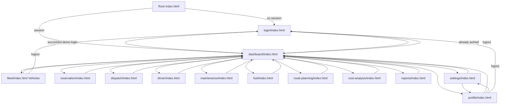
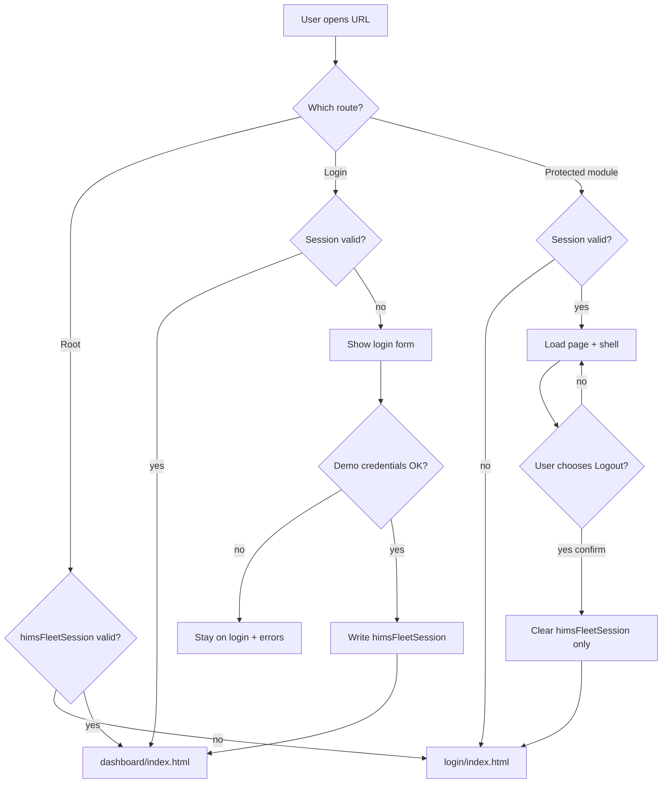
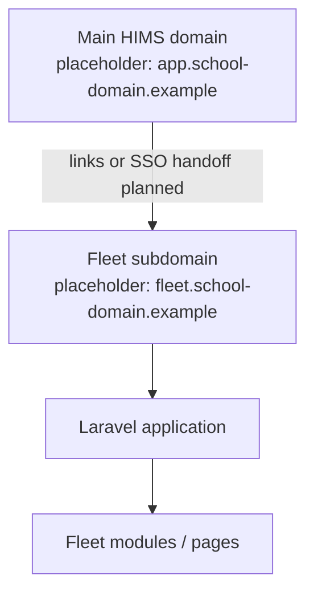

# Routing Architecture

## Fleet & Transportation Management Module

**Hospital Information Management System (HIMS)**

| Field | Value |
| ----- | ----- |
| **Document purpose** | Official routing and navigation contract for the Fleet frontend |
| **Current routing model** | Multi-page HTML navigation (folder routes + `index.html`) |
| **Auth model (current)** | Frontend session simulation — not server security |
| **Structure freeze** | 1.0 — [docs/03-FOLDER-STRUCTURE.md](./03-FOLDER-STRUCTURE.md) |
| **Related** | [docs/04-PROJECT-ARCHITECTURE.md](./04-PROJECT-ARCHITECTURE.md), [docs/07-JAVASCRIPT-ARCHITECTURE.md](./07-JAVASCRIPT-ARCHITECTURE.md), [docs/00-START-HERE.md](./00-START-HERE.md) |

---

## 1. Routing Overview

| Concern | Current state | Future state |
| ------- | ------------- | ------------ |
| Route resolution | Browser loads static HTML files by path | Laravel web routes (and optional API routes) |
| Navigation | Sidebar, navbar helpers, profile links, redirects | Same presentation navigation; server may render or redirect |
| Protection | Client guards (`auth-boot.js`, `requireAuth()`) | Laravel middleware + policies |
| Presentation | Frontend pages and components | Frontend remains presentation layer |

**Summary**

- Current routing is **frontend page navigation**.  
- Future routing will be **managed by Laravel**.  
- Frontend pages remain the **presentation layer**.  
- Do not invent REST paths here; map Laravel routes to these canonical page experiences later.

---

## 2. Route Inventory

Verified pages only. Paths are relative to the repository root when served over HTTP from the project root.

| Route (path) | Page file | `body data-page` | Purpose | Authentication (current) |
| ------------ | --------- | ---------------- | ------- | ------------------------ |
| `/` | `index.html` | — | Entry redirect to login or dashboard based on `himsFleetSession` | Public entry; redirects |
| `/login/` | `login/index.html` | `login` | Sign-in (no shell) | Public; reverse-redirect if session exists |
| `/dashboard/` | `dashboard/index.html` | `dashboard` | Fleet overview | Protected (frontend guard) |
| `/fleet/` | `fleet/index.html` | `vehicles` | Vehicles management | Protected |
| `/reservation/` | `reservation/index.html` | `reservations` | Reservations | Protected |
| `/dispatch/` | `dispatch/index.html` | `dispatch` | Dispatch | Protected |
| `/driver/` | `driver/index.html` | `driver` | Drivers | Protected |
| `/maintenance/` | `maintenance/index.html` | `maintenance` | Maintenance | Protected |
| `/fuel/` | `fuel/index.html` | `fuel` | Fuel management | Protected |
| `/route-planning/` | `route-planning/index.html` | `route-planning` | Route planning | Protected |
| `/cost-analysis/` | `cost-analysis/index.html` | `cost-analysis` | Cost analysis | Protected |
| `/reports/` | `reports/index.html` | `reports` | Reports and analytics | Protected |
| `/profile/` | `profile/index.html` | `profile` | User profile | Protected |
| `/settings/` | `settings/index.html` | `settings` | Fleet settings | Protected |

### Canonical URL forms

When using a static server from the repo root, both of these typically work depending on server config:

- `.../dashboard/` (directory index)  
- `.../dashboard/index.html`  

Auth helpers and sidebar links use **`../<module>/index.html`** (or `./login/index.html` / `./dashboard/index.html` from root).

### Naming note (frozen)

| User-facing label | Path | Active nav `data-page` |
| ----------------- | ---- | ---------------------- |
| Vehicles | `fleet/` | `vehicles` |

Do not rename `fleet/` without a Breaking change under structure freeze rules.

---

## 3. Navigation Flow

Primary sources of navigation:

| Source | Targets |
| ------ | ------- |
| Sidebar | All protected modules + profile/settings |
| Profile menu | Profile, System Settings, Logout |
| Root `index.html` | Login or Dashboard |
| Login success | Dashboard |
| Logout | Login |
| Dashboard shortcuts | Module routes via dashboard JS helpers |
| Navbar global search | Navigates to related module routes when results exist |

Sidebar groups (verified labels):

1. **MAIN MENU** — Dashboard  
2. **FLEET MANAGEMENT** — Vehicles, Reservations, Dispatch  
3. **OPERATIONS** — Drivers, Maintenance, Fuel, Route Planning  
4. **ANALYTICS** — Cost Analysis, Reports  
5. **SYSTEM** — Settings  
6. **Profile menu** — Profile, System Settings, Appearance, Help, Logout  

---

## 4. Protected Routes

### Public routes (current)

| Route | Notes |
| ----- | ----- |
| `index.html` | Redirect only |
| `login/index.html` | Public form; if session exists → dashboard |

### Protected routes (current)

All module pages listed in Section 2 except login and root:

`dashboard`, `fleet`, `reservation`, `dispatch`, `driver`, `maintenance`, `fuel`, `route-planning`, `cost-analysis`, `reports`, `profile`, `settings`.

### Current frontend guard

| Mechanism | File | Behavior |
| --------- | ---- | -------- |
| Early head gate | `assets/js/core/auth-boot.js` | Unauthenticated app pages → `../login/index.html`; authenticated login → `../dashboard/index.html` |
| Session API gate | `assets/js/core/auth.js` → `requireAuth()` | Used by `include.js` on protected pages |
| Root redirect | `index.html` | Session → dashboard; else login |
| Login reverse gate | `redirectIfAuthenticated()` / login.js | Session → dashboard |

**Important:** These guards are **UX only**. They are not Laravel middleware and are not security controls.

### Future Laravel middleware (planned — not implemented)

| Middleware concept | Role |
| ------------------ | ---- |
| `auth` / guest | Require or forbid authenticated users |
| Role / permission middleware | Enforce User Role Matrix on server |
| CSRF (web) | Protect form posts |
| Throttle | Rate-limit login |

Do not invent middleware class names beyond standard Laravel concepts.

---

## 5. Role-Based Navigation

**Status:** Not implemented as enforced authorization in the frontend.

Reference the future dedicated matrix: planned `docs/21-ROLE-MATRIX.md` (User Role Matrix).

Illustrative roles for **navigation visibility planning** only:

| Role | Expected visibility (presentation planning) |
| ---- | --------------------------------------------- |
| Fleet Manager | Broad operational + analytics access |
| Dispatcher | Dispatch, reservations, vehicles, drivers emphasis |
| Driver | Limited self-service views (when defined by matrix) |
| Department Head | Reservations / department-scoped views |
| Finance | Cost analysis, reports emphasis |
| Maintenance | Maintenance, vehicles, fuel emphasis |
| IT Admin | Settings, profile, system configuration |

### Presentation concepts (future UX)

| Concept | Meaning |
| ------- | ------- |
| Navigation visibility | Hide sidebar items not applicable to the role |
| Menu hiding | Remove unauthorized actions from toolbars/menus |
| Read-only routes | Allow view, disable mutate controls |
| Role redirects | Optional default landing page per role |

**Server remains authoritative.** Hidden links must still be blocked by Laravel if requested directly.

---

## 6. Authentication Redirect Flow

| Step | Implementation |
| ---- | -------------- |
| Login success | `auth.js` `login()` then navigate to dashboard |
| Logout | Profile menu → `performFleetLogout()` → confirm → clear session → login |
| Protected denial | `auth-boot.js` / `requireAuth()` → login |
| Already logged in on login | Redirect dashboard |

---

## 7. Subdomain Routing

### Approved deployment architecture (conceptual)

The Fleet module is intended to deploy as a focused application surface, independently operable under the official HostForge environment, and reachable as a **Fleet subdomain** of the main HIMS school domain.

### Placeholders (do not invent production hostnames)

| Concept | Placeholder |
| ------- | ----------- |
| Main HIMS domain | `https://app.<school-domain>` |
| Fleet subdomain | `https://fleet.<school-domain>` |
| Local development | `http://localhost:<port>/` serving this repository root |

Exact production DNS names are owned by the deployment/HostForge configuration and are **not** hard-coded in this frontend repository.

### Implications

| Concern | Guidance |
| ------- | -------- |
| Asset paths | Prefer relative paths already used by the freeze (`../assets/...`) |
| Cookies / sessions (future) | Configure Laravel session domain carefully for subdomain |
| CORS (if SPA-style API later) | Not required for classic same-origin Laravel web routes under the fleet host |
| Deep links | Preserve canonical module paths when migrating to Laravel routes |

---

## 8. Future Laravel Routes

Laravel will eventually own route registration. Document **patterns only** — no invented endpoint list.

| Area | General approach |
| ---- | ---------------- |
| `routes/web.php` | Page/controller routes mapping to Fleet screens (Blade or served SPA-like views) |
| `routes/api.php` | Optional JSON APIs for module data if the team adopts API-driven UI |
| Controllers | One resource/controller area per module domain |
| Route model binding | Bind vehicles, drivers, reservations, etc. when models exist |
| Middleware | `auth`, role/permission checks, CSRF on web forms |
| Policies | Authorize view/update/delete per User Role Matrix |

### Mapping principle

| Frontend canonical experience | Laravel should expose an equivalent user-facing route |
| ----------------------------- | ----------------------------------------------------- |
| `login/index.html` | Login (Breeze or approved auth routes) |
| `dashboard/index.html` | Dashboard home |
| `fleet/index.html` | Vehicles index |
| Other module `*/index.html` | Matching named routes / resource indexes |

Preserve navigation labels and hierarchy even if URL shapes become `/vehicles` instead of `/fleet/` — any path change is a **Breaking** navigation contract change and must be documented.

---

## 9. Route Ownership

| Route layer | Owner | Notes |
| ----------- | ----- | ----- |
| Presentation pages / components | Frontend | HTML/CSS/JS structure |
| Navigation chrome (sidebar/navbar links) | Frontend | Visibility may later be role-filtered for UX |
| Client soft redirects | Frontend (temporary) | Not security |
| Authentication | Laravel (future) | Replace `himsFleetSession` simulation |
| Authorization | Laravel (future) | Policies / middleware |
| Validation | Laravel (future) | Authoritative rules |
| Session / cookies | Laravel (future) | Secure server sessions |
| Persistence / data routes | Laravel (future) | DB-backed |
| DNS / subdomain hosting | Deployment / HostForge | Outside this frontend repo |

---

## 10. Routing Best Practices

1. **Stable URLs** — Prefer keeping current module folder names during early Laravel mapping.  
2. **No duplicate routes** — One canonical page per module experience.  
3. **One canonical page** — e.g. Vehicles only via `fleet/` (not a second vehicles folder).  
4. **Incremental migration** — Convert auth and one module at a time.  
5. **Preserve current navigation** — Sidebar order and labels are the user contract.  
6. **Document route changes** — Update this file, structure freeze docs, and QA checklists.  
7. **Never rely on client guards alone** after backend go-live.  
8. **Relative links** — Keep working under subdirectory or subdomain base paths.  
9. **Login remains shell-free** — No sidebar/navbar on the sign-in route.  
10. **Logout always returns to login** and clears only the auth session key on the frontend simulation.

---

## 11. Related Documentation

| Document | Status | Purpose |
| -------- | ------ | ------- |
| [docs/00-START-HERE.md](./00-START-HERE.md) | Existing | Handover, run steps |
| [docs/01-PROJECT-OVERVIEW.md](./01-PROJECT-OVERVIEW.md) | Existing | Product overview |
| [docs/02-TECH-STACK.md](./02-TECH-STACK.md) | Existing | Stack |
| [docs/03-FOLDER-STRUCTURE.md](./03-FOLDER-STRUCTURE.md) | Existing | Frozen paths |
| [docs/04-PROJECT-ARCHITECTURE.md](./04-PROJECT-ARCHITECTURE.md) | Existing | Architecture |
| [docs/05-DESIGN-SYSTEM.md](./05-DESIGN-SYSTEM.md) | Existing | Visual contract |
| [docs/06-COMPONENT-SYSTEM.md](./06-COMPONENT-SYSTEM.md) | Existing | Components / sidebar |
| [docs/07-JAVASCRIPT-ARCHITECTURE.md](./07-JAVASCRIPT-ARCHITECTURE.md) | Existing | Auth/theme JS |
| [docs/08-ROUTING.md](./08-ROUTING.md) | Existing | This routing document |
| `docs/09-AUTHENTICATION.md` | Planned | Auth replacement design |
| `docs/12-BACKEND-INTEGRATION.md` | Planned | Integration playbook |
| `docs/14-API-CONTRACT.md` | Planned | API endpoints when defined |
| `docs/21-ROLE-MATRIX.md` | Planned | Role navigation and permissions |

---

## 12. Final Recommendation

The documented routing structure is the approved navigation contract for the Fleet module.

Laravel should preserve the existing user navigation while replacing authentication, authorization, and data handling.

Role-based route visibility must follow the approved User Role Matrix, while server-side middleware and policies remain the authoritative security layer.

---

## Document control

| Field | Value |
| ----- | ----- |
| Path | `docs/08-ROUTING.md` |
| Type | Routing architecture |
| Production code changes | None |
| Public routes | Root entry + login |
| Protected module routes | 12 pages (dashboard through settings/profile) |
| Guard implementation | `auth-boot.js`, `auth.js`, root `index.html` |
| Vehicles path | `fleet/index.html` (`data-page="vehicles"`) |
