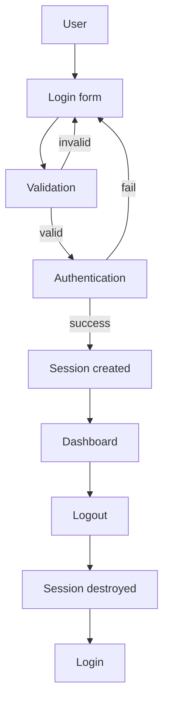
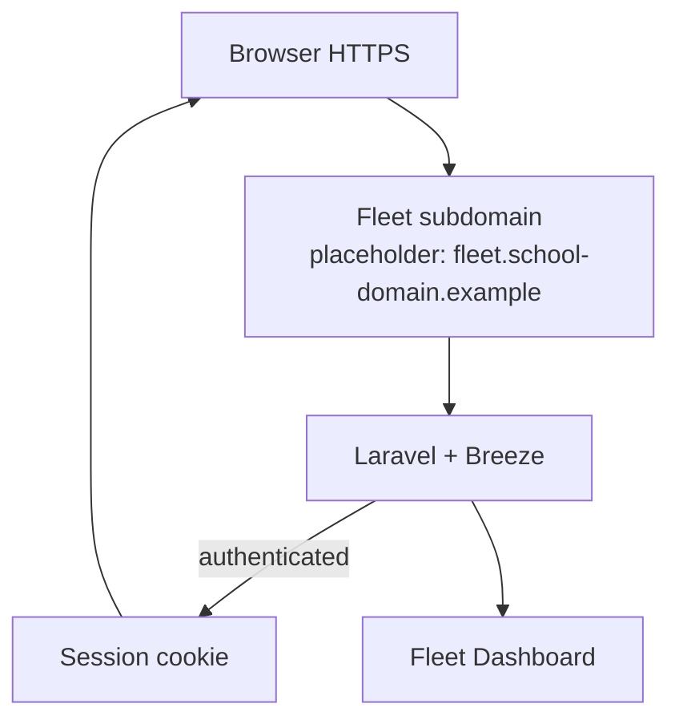
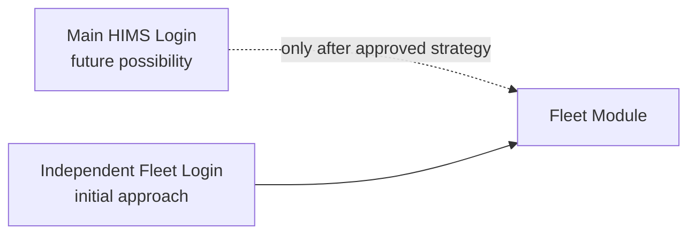

# Authentication Architecture

## Fleet & Transportation Management Module

**Hospital Information Management System (HIMS)**

| Field | Value |
| ----- | ----- |
| **Document purpose** | Official authentication architecture for Laravel integrators and maintainers |
| **Current auth model** | Frontend session simulation only — **not secure** |
| **Approved production direction** | Laravel Breeze (session-based authentication) |
| **Primary seam** | `assets/js/core/auth.js` |
| **Related** | [docs/07-JAVASCRIPT-ARCHITECTURE.md](./07-JAVASCRIPT-ARCHITECTURE.md), [docs/08-ROUTING.md](./08-ROUTING.md), [docs/04-PROJECT-ARCHITECTURE.md](./04-PROJECT-ARCHITECTURE.md) |

---

## 1. Authentication Overview

| Topic | Status |
| ----- | ------ |
| Current frontend | Simulated authentication for local UI flow |
| Production target | Laravel Breeze session authentication |
| Credential validation (future) | Server-side |
| Session authority (future) | Laravel / secure cookies |
| Frontend role (future) | Presentation: login form, error display, navigation after auth |

**Principles**

- Current frontend uses **simulated** authentication.  
- Future production authentication will use **Laravel Breeze**.  
- Authentication becomes **server-side**.  
- Frontend becomes **presentation only** for login/logout UX.  
- Client route guards are **not** security controls.

---

## 2. Current Frontend Flow

Inspected implementation only. No invented APIs.

### Files involved

| File | Role |
| ---- | ---- |
| `login/index.html` | Login UI (no sidebar/navbar) |
| `assets/js/auth/login.js` | Form validation, submit, toasts, redirect |
| `assets/js/core/auth.js` | Session API: login, logout, requireAuth, paths |
| `assets/js/core/auth-boot.js` | Early head redirect gate |
| `assets/js/core/include.js` | Secondary `requireAuth()` before shell load |
| `assets/js/core/main.js` | Profile menu logout → `performFleetLogout()` |
| `index.html` | Root entry: session → dashboard, else login |

### Login page

| Element | Detail |
| ------- | ------ |
| Route | `login/index.html` |
| Form | `#loginForm` — email, password, remember me, forgot password (placeholder), submit |
| Accessibility | Labels, autocomplete `username` / `current-password`, field errors, `role="alert"` |
| Notice | Explicitly states frontend session only — not real authentication |
| Demo credentials (UI + code) | Email `admin@talahospital.com` · Password `admin123` |
| Forgot password | Toast: recovery available after authentication integration |

### Client validation (`login.js`)

1. Required email and password  
2. Email format check  
3. Disable submit while “Signing in…”  
4. Call `login(email, password, remember)` from `auth.js`  
5. On failure: toast + re-enable button  
6. On success: welcome toast + `location.replace("../dashboard/index.html")`  

### Session API (`auth.js`)

| Function | Behavior |
| -------- | -------- |
| `login(email, password, remember)` | Normalize email; validate; compare demo credentials; write session object **without password** |
| `logout()` | Remove session key only |
| `isAuthenticated()` | Session exists and `authenticated === true` |
| `getCurrentUser()` | user, email, loginTime, remember |
| `requireAuth()` | Redirect to login if unauthenticated (skip on login page) |
| `redirectIfAuthenticated()` | Login page → dashboard if session exists |
| `performFleetLogout()` | Confirm dialog → logout → login redirect |
| Path helpers | `getAuthLoginPath()`, `getAuthDashboardPath()`, `isLoginPage()` |

### Session storage

| Key | `himsFleetSession` |
| --- | ------------------ |
| Success payload fields | `authenticated: true`, `user`, `email`, `loginTime` (ISO), `remember` |
| Remember me checked | `localStorage` |
| Remember me unchecked | `sessionStorage` |
| Password | **Never stored** |
| Logout scope | Clears `himsFleetSession` only; keeps theme, profile, settings, fleet data keys |

### Session checking and redirects

| Trigger | Behavior |
| ------- | -------- |
| `auth-boot.js` on protected module | No session → `../login/index.html` |
| `auth-boot.js` on login | Session present → `../dashboard/index.html` |
| `include.js` | `requireAuth()` after loading `auth.js` |
| Root `index.html` | Session → `./dashboard/index.html`; else `./login/index.html` |
| Logout | Confirm → clear session → login |

### Protected path set (frontend guard regex)

`dashboard`, `fleet`, `reservation`, `dispatch`, `driver`, `maintenance`, `fuel`, `route-planning`, `cost-analysis`, `reports`, `settings`, `profile`

### Security status of current flow

| Claim | Truth |
| ----- | ----- |
| Real authentication | No |
| Secure password handling | No (demo constants in JS) |
| Server session | No |
| Authorization / roles | No |
| Suitable for production hospital data | No |

---

## 3. Future Laravel Authentication

**Approved direction:** Laravel Breeze with **session-based** authentication.

Documented as architecture only — **not implemented** in this repository.

| Capability | Planned ownership |
| ---------- | ----------------- |
| Laravel Breeze scaffolding | Backend |
| Session authentication (cookies) | Backend |
| CSRF protection | Backend (web middleware) |
| Password hashing | Backend (`Hash` / bcrypt/argon as configured by Laravel) |
| Remember Me | Backend (Laravel remember token / Breeze defaults) |
| Email verification | Optional later; not required for initial Fleet cutover |
| Password reset | Future; login currently shows a non-functional recovery placeholder |

### Replacement seams

| Frontend today | Laravel tomorrow |
| -------------- | ---------------- |
| Demo email/password in `auth.js` | User table + hashed passwords |
| `himsFleetSession` JSON | Server session + cookie |
| `login()` JS function | POST login form or Breeze login route |
| `logout()` JS clear storage | POST logout + session invalidate |
| `requireAuth()` client redirect | `auth` middleware |
| Soft menu visibility | Policies / gates (authorization) |

Frontend keeps:

- Login layout and validation presentation  
- Error and success messaging patterns  
- Post-login navigation UX  
- Logout control placement (profile menu)

---

## 4. Authentication Lifecycle

Current simulation and future server auth share the same **user journey** shape:

| Stage | Current frontend | Future Laravel |
| ----- | ---------------- | -------------- |
| Validation | Client (`login.js` + `login()`) | Client UX + server rules |
| Authentication | Demo credential compare in JS | Breeze / Auth guard |
| Session created | Browser storage object | Encrypted session + cookie |
| Dashboard | Static page if guard passes | Middleware-protected route |
| Logout | Confirm + clear key | Session destroy + logout route |
| Session destroyed | Remove `himsFleetSession` | Invalidate server session |

---

## 5. Session Management

### Current frontend storage

| Concern | Behavior |
| ------- | -------- |
| Key | `himsFleetSession` |
| Locations | `sessionStorage` and/or `localStorage` |
| Validity | JSON parse succeeds and `authenticated === true` |
| Expiration | No TTL implemented; sessionStorage ends with tab; localStorage persists until logout/clear |
| Remember Me | Chooses localStorage vs sessionStorage only |
| Invalidation | `clearAuthSessionOnly()` on logout or before new login |
| Multi-tab | Shared localStorage remember sessions; sessionStorage is per-tab |
| Browser private mode | Storage may fail; login returns storage error message |

### Future Laravel session

| Concern | Expected production behavior |
| ------- | ---------------------------- |
| Storage | Server-side session store + session cookie |
| Expiration | Configured idle/lifetime in Laravel |
| Remember Me | Laravel remember me mechanism (when enabled) |
| Invalidation | Logout, password change, forced revoke as designed |
| Secure flags | HTTPS, `Secure`, `HttpOnly`, `SameSite` as configured |
| CSRF | Required for cookie session web posts |

### What logout must not clear (current and preserved intent)

On frontend simulation, logout does **not** remove:

- `himsFleetTheme`  
- `himsFleetUserProfile`  
- `himsFleetSettings`  
- Operational/demo fleet data keys  

Laravel logout should destroy **auth session** only unless product rules require broader wipe.

---

## 6. Role-Based Authentication

**Not implemented** in the current frontend beyond a default display identity.

Default simulated user label: **Fleet Administrator** (`auth.js` session `user` field / profile defaults).

Reference the official matrix: [docs/21-ROLE-MATRIX.md](./21-ROLE-MATRIX.md) (User Role Matrix).

### Expected login behavior (future — presentation + server)

| Role | After successful login (planned expectations) |
| ---- | --------------------------------------------- |
| Fleet Manager | Dashboard access; broad module navigation |
| Dispatcher | Dashboard; dispatch/reservations/vehicles emphasis |
| Driver | Limited modules per matrix |
| Department Head | Scoped operational views per matrix |
| Finance | Cost/reports emphasis per matrix |
| Maintenance | Maintenance/vehicles/fuel emphasis per matrix |
| IT Admin | Settings and system configuration access per matrix |

### Concepts

| Concept | Owner |
| ------- | ----- |
| Successful login | Laravel validates credentials and roles |
| Dashboard access | Middleware + route permission |
| Navigation visibility | Frontend UX may hide items; **not** security |
| Unauthorized requests | Laravel returns 403; frontend shows error/redirect |

Do not implement authorization in documentation; do not treat menu hiding as auth.

---

## 7. Authentication Boundaries

| Concern | Frontend | Laravel |
| ------- | -------- | ------- |
| Login UI | Yes | No (serves/hosts view only) |
| Credential validation | Temporary demo only | **Yes** (authoritative) |
| Password hashing | No | **Yes** |
| Sessions | Simulated browser key | **Yes** (authoritative) |
| Logout UI | Yes (profile menu + confirm) | Triggers server logout |
| Session destruction | Clears local key only | **Yes** (authoritative) |
| Menu visibility | Yes (UX) | No (not sufficient) |
| Authorization | No | **Yes** |
| CSRF | No | **Yes** |
| Remember Me (real) | Storage choice only | **Yes** |
| Password reset | Placeholder toast | **Yes** (future) |
| Theme/profile prefs | Frontend storage | Optional sync later |

---

## 8. HostForge Deployment

Production authentication is expected to run under the Fleet deployment host (subdomain architecture documented in [docs/08-ROUTING.md](./08-ROUTING.md)).

### Production requirements (architecture rules)

| Requirement | Reason |
| ----------- | ------ |
| HTTPS | Protect credentials and cookies in transit |
| Secure session cookies | Reduce interception risk |
| HttpOnly cookies | Mitigate XSS cookie theft |
| CSRF protection | Protect session-authenticated state changes |
| SameSite cookie policy | Reduce CSRF/cross-site risks as configured |
| No demo credentials in production | Remove frontend demo auth constants before go-live |
| Server-side auth only | Disable reliance on `himsFleetSession` as authority |

Exact HostForge hostnames are environment-owned placeholders, not hard-coded in this repository.

---

## 9. Future Main HIMS Integration

| Phase | Approach |
| ----- | -------- |
| Initial production | **Independent Fleet login** via Laravel Breeze on the Fleet host |
| Later possibility | Main HIMS login handoff into Fleet |

**Rules**

- Do **not** design or implement SSO in this phase.  
- Centralized authentication with Main HIMS requires a separate approved strategy.  
- Until then, Fleet authentication remains self-contained under Laravel on the Fleet deployment.

---

## 10. Authentication Best Practices

| Practice | Application |
| -------- | ----------- |
| Strong passwords | Enforce on Laravel user rules |
| Secure cookies | Production session configuration |
| HTTPS | Required on HostForge / production |
| Session timeout | Configure Laravel session lifetime |
| Least privilege | Roles + policies from User Role Matrix |
| Server-side authorization | Every sensitive route and action |
| Role validation | On login and on each authorized action |
| Audit logging | Login success/failure, logout, privilege use (backend) |
| CSRF | Web middleware on state-changing requests |
| XSS protection | Escape output; keep tokens out of JS where possible |
| No secrets in frontend | Never ship production passwords or API secrets in JS |
| Incremental cutover | Replace `auth.js` simulation only after Breeze works |
| Preserve UX | Keep login layout, toasts, logout confirm flow |

---

## 11. Related Documentation

| Document | Status | Purpose |
| -------- | ------ | ------- |
| [docs/04-PROJECT-ARCHITECTURE.md](./04-PROJECT-ARCHITECTURE.md) | Existing | Auth layer in system architecture |
| [docs/07-JAVASCRIPT-ARCHITECTURE.md](./07-JAVASCRIPT-ARCHITECTURE.md) | Existing | Auth JS APIs and init order |
| [docs/08-ROUTING.md](./08-ROUTING.md) | Existing | Public/protected routes, redirects, subdomain |
| [docs/09-AUTHENTICATION.md](./09-AUTHENTICATION.md) | Existing | This document |
| [docs/10-THEME-SYSTEM.md](./10-THEME-SYSTEM.md) | Existing | Theme (session logout preserves theme key) |
| [docs/12-BACKEND-INTEGRATION.md](./12-BACKEND-INTEGRATION.md) | Existing | Cutover playbook including auth |
| [docs/21-ROLE-MATRIX.md](./21-ROLE-MATRIX.md) | Existing | Roles and permissions |
| [docs/22-DEPLOYMENT-ARCHITECTURE.md](./22-DEPLOYMENT-ARCHITECTURE.md) | Existing | Deployment architecture |
| [docs/23-HOSTING-INFRASTRUCTURE.md](./23-HOSTING-INFRASTRUCTURE.md) | Existing | HostForge hosting infrastructure |
| [docs/00-START-HERE.md](./00-START-HERE.md) | Existing | Integrator entry and demo notice |

---

## 12. Final Recommendation

Laravel Breeze with session-based authentication is the approved authentication architecture for the Fleet module.

Frontend authentication should remain presentation-focused while Laravel performs credential validation, session management, and authorization.

Future integration with the Main HIMS authentication system should be implemented only after an approved centralized authentication strategy has been established.

---

## Document control

| Field | Value |
| ----- | ----- |
| Path | `docs/09-AUTHENTICATION.md` |
| Type | Authentication architecture |
| Production code changes | None |
| Session key (current) | `himsFleetSession` |
| Demo email (current UI only) | `admin@talahospital.com` |
| Demo password (current UI only) | `admin123` |
| Approved production stack | Laravel Breeze sessions |
| SSO / Main HIMS SSO | Out of scope until approved |
