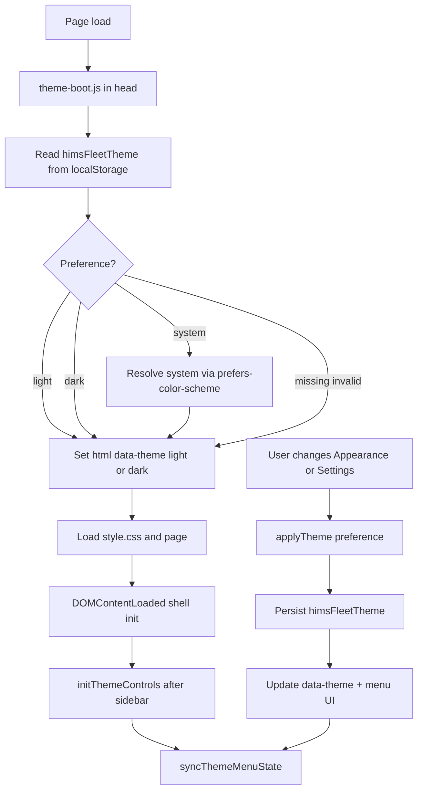
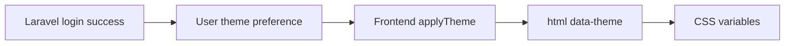

# Theme System

## Fleet & Transportation Management Module

**Hospital Information Management System (HIMS)**

| Field | Value |
| ----- | ----- |
| **Document purpose** | Official theme engine reference for frontend and Laravel integrators |
| **Theme status** | Active; frontend-owned presentation |
| **Storage key** | `himsFleetTheme` |
| **Resolved attribute** | `document.documentElement` `data-theme` = `light` \| `dark` |
| **Token source** | `assets/css/base/variables.css` (comment: Version 1.1 — Theme System) |
| **Related** | [docs/05-DESIGN-SYSTEM.md](./05-DESIGN-SYSTEM.md), [docs/07-JAVASCRIPT-ARCHITECTURE.md](./07-JAVASCRIPT-ARCHITECTURE.md) |

---

## 1. Theme Overview

The theme engine provides consistent light and dark presentation across every Fleet page, including login.

| Goal | How it is achieved |
| ---- | ------------------ |
| Purpose | Apply a single appearance model without per-page theme forks |
| Consistency | Shared CSS tokens switch under `html[data-theme]` |
| User personalization | Preference stored as `himsFleetTheme` (`light` \| `dark` \| `system`) |
| Flash avoidance | `theme-boot.js` runs in `<head>` before styles |
| Future Laravel compatibility | Backend may persist preference; frontend still applies `data-theme` and tokens |

There is **one** theme system. Do not create a second theme engine, second storage key, or parallel CSS theme tree.

---

## 2. Theme Architecture

There is **no** `theme.js` file in the repository. Theme logic is split across boot, shell, settings, and CSS tokens.

### JavaScript

| File | Responsibility |
| ---- | -------------- |
| `assets/js/core/theme-boot.js` | Pre-paint IIFE: read preference, resolve system, set `data-theme` |
| `assets/js/core/main.js` | Runtime API: preference get/set, apply, sync menu, system listener, `initThemeControls()` |
| `assets/js/settings/settings.js` | Settings appearance radios (`name="settingsTheme"`); uses shared key via `applyTheme` when available |
| `assets/js/settings/settings-store.js` | Documents that theme stays in `himsFleetTheme` only (not inside settings JSON blob ownership for theme) |
| `assets/js/core/include.js` | After sidebar load, calls `initThemeControls()` when present |
| `assets/js/core/auth.js` | Logout clears session only — **does not** clear theme |

### HTML / components

| File | Responsibility |
| ---- | -------------- |
| All module + login pages | Load `theme-boot.js` in `<head>` before `style.css` |
| `components/shared/sidebar.html` | Appearance submenu: Light / Dark / System (`data-theme-option`) |

### CSS

| File | Responsibility |
| ---- | -------------- |
| `assets/css/base/variables.css` | Light and dark token sets |
| `assets/css/style.css` | Imports base (including variables), components, pages, responsive |
| Component/page CSS | Consume tokens (`var(--color-*)`, etc.); some page-level hardcodes exist (see design system) |

### Runtime API (`main.js`) — verified functions

| Function | Role |
| -------- | ---- |
| `getSystemTheme()` | `prefers-color-scheme: dark` → `dark`, else `light` |
| `getThemePreference()` | Saved preference: `light` \| `dark` \| `system` (default `light`) |
| `getResolvedTheme(preference)` | Preference → resolved `light` \| `dark` |
| `getSavedTheme()` | Backward-compatible alias returning **resolved** light/dark |
| `applyTheme(theme, options)` | Validate preference, set `data-theme`, optionally persist, sync menu |
| `syncThemeMenuState()` | Sync `#sidebarProfileMenu [data-theme-option]` active/aria-checked |
| `updateAppearanceTriggerLabel()` | Updates `#profileAppearanceCurrent` text |
| `initSystemThemeListener()` | Re-resolve when OS theme changes if preference is `system` |
| `applyEarlyTheme()` | Re-apply current preference without forcing persist path nuances |
| `initThemeControls()` | Bind appearance menu clicks; init system listener |

Constant: `HIMS_FLEET_THEME_KEY = "himsFleetTheme"`.

---

## 3. Supported Themes

### Preference values (verified)

| Preference | Meaning | Resolved `data-theme` |
| ---------- | ------- | --------------------- |
| `light` | Force light surfaces | `light` |
| `dark` | Force dark surfaces | `dark` |
| `system` | Follow OS | `light` or `dark` via `prefers-color-scheme` |

### Where each can be selected

| Surface | Light | Dark | System |
| ------- | ----- | ---- | ------ |
| Profile Appearance submenu | Yes | Yes | Yes |
| Theme boot / main.js API | Yes | Yes | Yes |
| Settings appearance radios | Yes | Yes | **Not available yet** in Settings UI (page copy states System is not available yet; only light/dark radios) |

**Important:** System is a first-class engine preference. Settings currently exposes only light/dark for form radios and maps resolved values through `getSavedTheme()` / light-dark helpers. Profile menu remains the complete selector for all three preferences.

No other themes (e.g. high-contrast custom skins) are implemented.

---

## 4. Initialization Flow

| Stage | Detail |
| ----- | ------ |
| Page load | Every app/login page includes `theme-boot.js` before CSS |
| Theme storage | Preference in `localStorage` key `himsFleetTheme` |
| Apply theme | `data-theme` on `<html>` drives CSS token blocks |
| Render UI | Components use CSS variables |
| Sync components | Profile menu radios/checks; settings radios when on Settings page |

On protected pages, `include.js` calls `initThemeControls()` after the sidebar fragment is injected so the Appearance submenu exists.

---

## 5. Storage

### Current

| Item | Value |
| ---- | ----- |
| Key | `himsFleetTheme` |
| API | `localStorage` only (not sessionStorage) |
| Allowed values | `light`, `dark`, `system` |
| Default when missing/invalid | Treat as `light` |
| Logout behavior | **Preserved** — auth clears `himsFleetSession` only |
| Settings JSON | Theme is **not** the settings store key; settings code comments require shared `himsFleetTheme` only |

### Future Laravel user preferences

| Concern | Direction |
| ------- | --------- |
| Persist preference per user | Laravel user profile / preferences column or settings table |
| Load after login | Return preference with auth user payload or preferences endpoint |
| Apply on client | Still call existing `applyTheme(preference)` / set `data-theme` |
| Offline/local cache | May keep `himsFleetTheme` as cache of last known preference |

Laravel must not invent a second client key for the same concern without a migration plan.

---

## 6. Appearance Menu

### Profile dropdown (complete selector)

| Element | Role |
| ------- | ---- |
| `#profileAppearanceTrigger` | Opens appearance submenu |
| `#profileAppearanceCurrent` | Shows Light / Dark / System label |
| `#profileAppearanceSubmenu` | Menu of theme options |
| `[data-theme-option="light\|dark\|system"]` | `role="menuitemradio"` options |
| Click handler | `initThemeControls()` → `applyTheme(theme)` |

Sync marks active option with `.is-active` and `aria-checked`.

### Settings integration

| Element | Role |
| ------- | ---- |
| `input[name="settingsTheme"]` | Light and Dark radios only |
| Copy on page | States theme stored in `himsFleetTheme`; System not available yet in this form |
| Preview | Changing radio can preview immediately; Save/Cancel flows manage baseline vs dirty theme in settings JS |
| Shared API | Prefers `applyTheme` / `syncThemeMenuState` from `main.js` when loaded |

### Future backend persistence

- Save preference with user settings on authenticated save.  
- On login, hydrate `himsFleetTheme` or call `applyTheme` with server value.  
- Keep Appearance menu and Settings as the same preference, not two sources of truth.

---

## 7. Theme Boundaries

| Concern | Frontend | Laravel (future) |
| ------- | -------- | ---------------- |
| Apply theme / set `data-theme` | **Yes** | No |
| Resolve system preference | **Yes** | No |
| CSS token switching | **Yes** | No |
| Appearance menu UI | **Yes** | No |
| Save user preference durably | Temporary via localStorage | **Yes** (authoritative per user) |
| Load preference after login | Reads localStorage today | **Yes** supply value to frontend |
| Persist across devices | Limited to browser today | **Yes** |
| Auth session | Independent | Independent |
| Invent new visual themes | Only with design-system approval | Does not own visuals |

---

## 8. CSS Variable Strategy

### How themes work in CSS

1. Light defaults live under `:root, html[data-theme="light"]`.  
2. Dark overrides live under `html[data-theme="dark"]`.  
3. Components reference semantic tokens, not ad hoc dual stylesheets.

### Token categories (see `variables.css` and [docs/05-DESIGN-SYSTEM.md](./05-DESIGN-SYSTEM.md))

| Category | Examples |
| -------- | -------- |
| Surfaces | `--color-bg`, `--color-surface`, `--color-surface-muted` |
| Text | `--color-text`, `--color-text-muted`, `--color-text-inverse` |
| Brand / status | `--color-primary*`, success/warning/danger/info sets |
| Borders | `--color-border*` |
| Shell | `--sidebar-bg`, `--navbar-bg`, modal/dropdown surfaces |
| Shadows | `--shadow-xs` … `--shadow-lg` (dark set overrides) |
| Typography | `--font-family`, `--font-size-*`, weights, line heights |
| Spacing | `--space-1` … `--space-12`, section/card gaps |
| Radius | `--radius-sm` … `--radius-pill` |
| Motion | `--transition-fast`, durations, easing |
| Layout | sidebar widths, navbar height, control heights |
| Z-index | dropdown, sticky, sidebar, navbar, modal |

### Extension rules

| Do | Do not |
| -- | ------ |
| Add new tokens to `variables.css` for both light and dark when themeable | Hardcode one-off colors in many files without tokens |
| Reuse semantic names (`--color-danger-text`) | Create `dark-button.css` forks |
| Keep mint primary identity across themes | Replace primary brand casually |
| Document new tokens in design system docs | Store theme colors inside Laravel views as inline styles |

Dark mode keeps mint identity with brighter primary values for contrast on dark surfaces (e.g. light primary `#00a86b`, dark primary `#12b87a`).

---

## 9. Accessibility

| Area | Theme-system relevance |
| ---- | ---------------------- |
| Contrast | Dark tokens adjust text, borders, and status colors for dark surfaces |
| Focus states | Shared focus rings use `--focus-ring` and primary outlines (theme-aware) |
| Readable typography | Shared Poppins scale and line heights; colors from tokens |
| Color independence | Status uses soft fills + text color pairs; do not rely on color alone for critical actions (pair with labels/icons) |
| Keyboard navigation | Appearance options are menu radios; focus-visible styles from design system |
| System preference | Honors OS light/dark when preference is `system` |
| Reduced motion | Separate from theme; motion CSS respects `prefers-reduced-motion` |

Recommended QA: verify Appearance menu keyboard path and contrast of any page-level hardcoded badge colors under dark theme (known design-system caveat for some page overrides).

---

## 10. Future Laravel Integration

| Step | Owner |
| ---- | ----- |
| Store preference per authenticated user | Laravel |
| Return preference after login / profile fetch | Laravel |
| On frontend init after auth | Call existing `applyTheme(serverPreference)` or write `himsFleetTheme` then boot |
| Rendering | Frontend only (`data-theme` + CSS tokens) |
| Changing theme in UI | Frontend applies immediately; optionally PATCH preference to Laravel |
| Logout | Do not wipe theme unless product requires reset; current auth preserves theme |

Frontend remains responsible for **rendering and synchronization**. Laravel remains responsible for **durable preference storage** when integrated.

---

## 11. Best Practices

1. **Single source of truth** — one key (`himsFleetTheme`), one apply path (`applyTheme` / theme-boot).  
2. **Avoid hardcoded colors** when a token exists.  
3. **Always use CSS variables** for themeable surfaces.  
4. **Preserve theme persistence** across logout (current product behavior).  
5. **Document new themes** in design system + this file before adding values.  
6. **Do not add `theme-v2.js`** or a second menu-driven engine.  
7. **Keep Settings and Appearance aligned** on the same key (extend Settings to System only if product requires parity).  
8. **Test light, dark, and system** after UI changes.  
9. **Do not couple theme to auth session** storage.  
10. **Laravel optional sync** must not break offline local preference apply.

---

## 12. Related Documentation

| Document | Status | Purpose |
| -------- | ------ | ------- |
| [docs/05-DESIGN-SYSTEM.md](./05-DESIGN-SYSTEM.md) | Existing | Tokens, colors, contrast notes |
| [docs/06-COMPONENT-SYSTEM.md](./06-COMPONENT-SYSTEM.md) | Existing | Appearance menu as component surface |
| [docs/07-JAVASCRIPT-ARCHITECTURE.md](./07-JAVASCRIPT-ARCHITECTURE.md) | Existing | Theme functions in core layer |
| [docs/09-AUTHENTICATION.md](./09-AUTHENTICATION.md) | Existing | Logout preserves theme |
| [docs/10-THEME-SYSTEM.md](./10-THEME-SYSTEM.md) | Existing | This document |
| `docs/12-BACKEND-INTEGRATION.md` | Planned | Preference sync cutover |
| `docs/15-LOCAL-STORAGE.md` | Planned | Full storage inventory including theme key |

---

## 13. Final Recommendation

The current theme engine should remain a frontend responsibility.

Laravel should only persist user theme preferences while the frontend continues to render and synchronize appearance using the existing theme architecture.

---

## Document control

| Field | Value |
| ----- | ----- |
| Path | `docs/10-THEME-SYSTEM.md` |
| Type | Theme system |
| Production code changes | None |
| Boot file | `assets/js/core/theme-boot.js` |
| Runtime file | `assets/js/core/main.js` |
| Storage key | `himsFleetTheme` |
| Preferences | `light`, `dark`, `system` |
| Resolved modes | `light`, `dark` |
| Settings UI | Light/Dark only (System not yet in Settings form) |
| Profile UI | Light / Dark / System |
