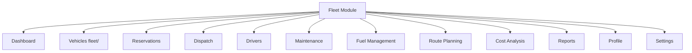
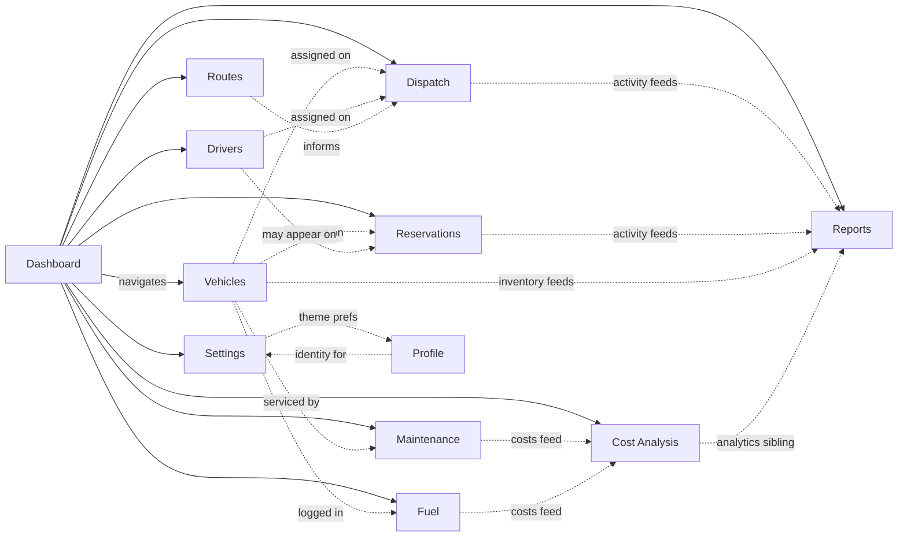

# Fleet Module Documentation

## Fleet & Transportation Management Module

**Hospital Information Management System (HIMS)**

| Field | Value |
| ----- | ----- |
| **Document purpose** | Master functional specification of implemented Fleet frontend modules |
| **Scope** | Verified presentation modules only |
| **Frontend status** | Complete (UI); data mostly simulated or client-local |
| **Backend status** | Pending Laravel integration |
| **Structure freeze** | 1.0 |
| **Related** | [docs/04-PROJECT-ARCHITECTURE.md](./04-PROJECT-ARCHITECTURE.md), [docs/08-ROUTING.md](./08-ROUTING.md), [docs/07-JAVASCRIPT-ARCHITECTURE.md](./07-JAVASCRIPT-ARCHITECTURE.md) |

---

## 1. Module Overview

The **Fleet & Transportation Management** module is a HIMS subsystem for hospital transportation operations at facilities such as Tala Hospital (branding used in the UI).

It supports day-to-day work for:

- Tracking hospital vehicles and operational status  
- Managing reservations and dispatch assignments  
- Coordinating drivers  
- Recording maintenance and fuel activity  
- Planning routes (with map placeholder for future mapping services)  
- Analyzing costs and producing operational reports  
- Managing operator profile and fleet settings  

Inside HIMS, Fleet is the transportation operations surface. It is designed to run as a focused frontend today and connect to Laravel/MySQL later without redesigning the presentation layer.

**Login** (`login/`) is the authentication entry (frontend session simulation). It is not a business operations module; see [docs/09-AUTHENTICATION.md](./09-AUTHENTICATION.md).

---

## 2. Module Hierarchy

Implemented business and support modules:

| Module | Canonical path |
| ------ | -------------- |
| Dashboard | `dashboard/index.html` |
| Vehicles | `fleet/index.html` |
| Reservations | `reservation/index.html` |
| Dispatch | `dispatch/index.html` |
| Drivers | `driver/index.html` |
| Maintenance | `maintenance/index.html` |
| Fuel Management | `fuel/index.html` |
| Route Planning | `route-planning/index.html` |
| Cost Analysis | `cost-analysis/index.html` |
| Reports | `reports/index.html` |
| Profile | `profile/index.html` |
| Settings | `settings/index.html` |

---

## 3. Module Summary Table

| Module | Purpose | Primary users (expected) | Frontend status | Future backend |
| ------ | ------- | ------------------------ | --------------- | -------------- |
| Dashboard | Operational overview and shortcuts | Managers, dispatchers, IT | Complete UI; sample KPIs / navigation | Live aggregates API |
| Vehicles | Fleet inventory CRUD | Fleet Manager, Maintenance, Dispatcher | Complete UI | Vehicle resource CRUD |
| Reservations | Transport booking workflow UI | Department Head, Dispatcher, Fleet Manager | Complete UI | Reservation workflow + approvals |
| Dispatch | Trip / dispatch coordination | Dispatcher, Fleet Manager | Complete UI | Dispatch lifecycle API |
| Drivers | Driver roster | Dispatcher, Fleet Manager | Complete UI | Driver CRUD |
| Maintenance | Maintenance records | Maintenance, Fleet Manager | Complete UI | Work orders / schedules |
| Fuel Management | Fuel logs and costs UI | Maintenance, Finance, Fleet Manager | Complete UI | Fuel transactions |
| Route Planning | Route records, templates, map placeholder | Dispatcher, Fleet Manager | Complete UI; map is placeholder | Routes + optional Maps |
| Cost Analysis | Cost charts, budgets, filters | Finance, Fleet Manager | Complete UI; sample/storage data | Cost queries / budgets |
| Reports | Multi-view analytics and export | Finance, Fleet Manager, Management | Complete UI; sample/storage data | Server reports |
| Profile | Operator profile presentation | All authenticated users | Complete UI; local profile storage | Auth user profile |
| Settings | Fleet unit preferences and appearance linkage | IT Admin, Fleet Manager | Complete UI; local settings storage | Persisted settings |

---

## 4. Dashboard

| Topic | Detail |
| ----- | ------ |
| **Path** | `dashboard/index.html` |
| **JS** | `assets/js/dashboard/dashboard.js` |
| **Purpose** | Executive overview of hospital fleet operations; navigation hub |

### Displayed content (verified UI)

- Facility banner (facility, unit, shift focus, operational status)  
- Primary KPI cards (e.g. available vehicles, active dispatches, drivers on duty, fuel-related indicator)  
- Additional dashboard sections: activity, charts/placeholders, status lists (page markup)  
- Live calendar date label updated by JS  

### Behavior

- **Navigation-focused** JS: interactive cards/controls route to modules via `DASHBOARD_ROUTES`  
- Does **not** perform module CRUD  
- Chart period control explains sample/static weekly view rather than inventing alternate datasets  

### Dependencies

- Shell: sidebar, navbar, toast, auth, theme  
- Shared design-system cards/stats  

### Future API

- Dashboard aggregate metrics  
- Recent activity feed  
- Real-time or near-real-time operational counts  

---

## 5. Vehicles

| Topic | Detail |
| ----- | ------ |
| **Path** | `fleet/index.html` (`data-page="vehicles"`) |
| **JS** | `assets/js/vehicle/*` (14 files) |
| **Modals** | `components/vehicle/` add, view, edit, delete |

### Features (verified)

| Feature | Implementation pattern |
| ------- | ------------------------ |
| Vehicle list | `.fleet-table` with sample/demo rows and JS-managed rows |
| Search | Toolbar search box |
| Filters | Type and status selects (`vehicleTypeFilter`, `vehicleStatusFilter`) |
| Add / Edit / View / Delete | Modal fragments + vehicle-add/edit/view/delete scripts |
| Image | Placeholder / upload handling via `vehicle-image.js` |
| Pagination | `vehicle-pagination.js` |
| Sort | `vehicle-sort.js` |
| Bulk actions | Bulk toolbar |
| Export | Print / PDF / Excel via export dropdown + CDN libs |
| Statistics | KPI stat cards + `vehicle-stats.js` |
| Status badges | available, trip/on trip, maintenance, etc. |

### Dependencies

- Shell components, toast, dropdown export, Bootstrap/xlsx/jspdf where included  
- Shared forms/tables/modals CSS  

### Future CRUD API

- Vehicle resource index/show/store/update/destroy  
- Status and type enumerations  
- Optional image upload storage  
- Server-side filter, sort, pagination  

---

## 6. Reservations

| Topic | Detail |
| ----- | ------ |
| **Path** | `reservation/index.html` |
| **JS** | `assets/js/reservation/*` (12 files) |
| **Modals** | `components/reservation/` |

### Features

- List, search/filter (including status), sort, pagination  
- Add / view / edit / delete modals  
- Bulk toolbar  
- Stats cards  
- Export (print/PDF/Excel)  
- Status presentation: pending, scheduled, approved, completed, cancelled, rejected (badge system + reservation page colors)  

### Workflow concept (UI-level)

Reservations represent transport booking records that can progress through statuses such as pending → approved/scheduled → completed (or cancelled/rejected). **Server-side approval rules are not implemented**; the frontend presents status badges and CRUD UX only.

### Dependencies

- Vehicles/drivers as reference concepts in forms (frontend data)  
- Shared shell and export tooling  

### Future backend

- Reservation entity with validation  
- Approval workflow and audit  
- Vehicle assignment conflicts  
- Department scoping  

---

## 7. Dispatch

| Topic | Detail |
| ----- | ------ |
| **Path** | `dispatch/index.html` |
| **JS** | `assets/js/dispatch/*` (12 files) |
| **Modals** | `components/dispatch/` |

### Features

- Dispatch list with filters (status/priority patterns as implemented on page)  
- Add / view / edit / delete  
- Bulk actions  
- Stats, sort, pagination  
- Export/print  
- Status badges for trip lifecycle presentation  

### Workflow concept (UI-level)

Dispatch coordinates assigned trips, typically linking operational context such as vehicle and driver. Assignment and status updates are **frontend CRUD behaviors** today.

### Future API

- Dispatch create/update with authorized status transitions  
- Driver and vehicle assignment rules  
- Real-time or polled status for active trips  

---

## 8. Drivers

| Topic | Detail |
| ----- | ------ |
| **Path** | `driver/index.html` |
| **JS** | `assets/js/driver/*` (13 files including `driver.js`) |
| **Modals** | `components/driver/` |

### Features

- Driver list, search, filters  
- Add / view / edit / delete  
- Bulk, sort, pagination  
- Stats  
- Export/print  
- Availability/status badge presentation (including module-specific refinements such as `out` where defined)  

### Future CRUD

- Driver master data  
- License/expiry fields if retained in UI  
- Availability for dispatch assignment  
- Linkage to user accounts (optional product decision)  

---

## 9. Maintenance

| Topic | Detail |
| ----- | ------ |
| **Path** | `maintenance/index.html` |
| **JS** | `assets/js/maintenance/*` (12 files) |
| **Modals** | `components/maintenance/` |

### Features

- Maintenance record list  
- Search, sort, pagination, bulk  
- Add / view / edit / delete  
- Statistics  
- Export/print  
- Status types such as scheduled, in progress, completed (badge system)  

### Future integration

- Work orders linked to vehicles  
- Cost fields feeding Cost Analysis / Reports  
- Schedules and preventive maintenance plans  
- Service provider records  

---

## 10. Fuel Management

| Topic | Detail |
| ----- | ------ |
| **Path** | `fuel/index.html` |
| **JS** | `assets/js/fuel/*` (12 files) |
| **Modals** | `components/fuel/` |

### Features

- Fuel log list  
- Search, sort, pagination, bulk  
- Add / view / edit / delete  
- Statistics  
- Export/print  
- Cost/quantity oriented fields in forms as implemented  

### Future reports

- Consumption trends  
- Cost by vehicle/period  
- Integration with Cost Analysis and Reports modules via APIs  

---

## 11. Route Planning

| Topic | Detail |
| ----- | ------ |
| **Path** | `route-planning/index.html` |
| **JS** | `assets/js/route-planning/*` (5 files: store, modal, pipeline, templates, export) |

### Features

- Route list tooling with filters (priority, status, vehicle, driver, department, date)  
- Stats cards  
- Route create/edit pipeline and templates (`route-store`, `route-templates`)  
- Client storage keys: `himsFleetRoutes`, `himsFleetRouteTemplates`  
- Export  
- Empty state support  

### Maps (verified)

- **Visual placeholder only** (`route-map-card`)  
- UI note: Google Maps integration available in backend implementation  
- **Not** an embedded Google Maps SDK in the current frontend  

### Future

- Persist routes in database  
- Optional Google Maps (or approved map provider) integration  
- Route optimization services if product requires them  

---

## 12. Cost Analysis

| Topic | Detail |
| ----- | ------ |
| **Path** | `cost-analysis/index.html` |
| **JS** | `assets/js/cost-analysis/*` (8 files) |

### Features

- Filters: date range, vehicle, department, category, analysis view (including budget analysis)  
- Presets bar (save/load analysis presets)  
- KPI stat cards  
- Custom CSS/SVG charts (not Chart.js)  
- Tables and budget tooling  
- Export (print/PDF/Excel as implemented)  
- Sample/localStorage-backed datasets when operational keys/samples exist  

### Cost dimensions presented

- Operational cost breakdowns by filters/views  
- Fuel vs maintenance oriented charts where coded  
- Budget vs actual style analysis views  
- Department and vehicle ranking presentations  

### Future backend

- Authoritative cost aggregation from fuel, maintenance, trips  
- Budget entities and history  
- Saved presets per user/role  

---

## 13. Reports

| Topic | Detail |
| ----- | ------ |
| **Path** | `reports/index.html` |
| **JS** | `assets/js/reports/*` (7 files) |

### Features

- Multi-view report UI (overview, utilization, trips, reservations, fuel, maintenance, drivers, etc. as implemented)  
- KPIs and view-specific KPI strip  
- Custom charts with empty states  
- Tables pipeline  
- Report presets (`himsFleetReportPresets`)  
- Export dropdown (print/PDF/Excel)  
- Optional reads of local operational keys with sample fallbacks  

### Future PDF/Excel generation

- Client export already exists via jsPDF/xlsx on the frontend  
- Server-side generation may be added later for large datasets and auditability  
- Do not remove client export until server export is approved and working  

---

## 14. Profile

| Topic | Detail |
| ----- | ------ |
| **Path** | `profile/index.html` |
| **JS** | `assets/js/profile/profile-page.js` + `assets/js/core/user-profile.js` |

### Features

- Profile overview and account fields presentation  
- Sync with sidebar identity (name, role, initials)  
- Client storage key: `himsFleetUserProfile`  

### Future backend synchronization

- Authenticated user profile from Laravel  
- Optional avatar upload  
- Role display from real authorization system  

---

## 15. Settings

| Topic | Detail |
| ----- | ------ |
| **Path** | `settings/index.html` |
| **JS** | `assets/js/settings/settings-store.js`, `settings.js` |

### Features

- Multi-section fleet configuration UI (general unit info, drivers-related prefs, operational toggles as present on page)  
- Appearance theme radios (Light/Dark; shared `himsFleetTheme`; System not offered in Settings form yet)  
- Import/export settings JSON patterns  
- Reset settings (preserves theme key as documented in UI/JS)  
- Client key: `himsFleetSettings`  

### Future user/unit settings persistence

- Store settings per tenant/unit in database  
- Authorize IT Admin / Fleet Manager changes  
- Keep theme preference strategy aligned with [docs/10-THEME-SYSTEM.md](./10-THEME-SYSTEM.md)  

---

## 16. Module Relationships

Solid lines: verified navigation relationships.  
Dashed lines: logical operational relationships presented or anticipated in UI (not necessarily enforced by a backend graph today).

---

## 17. Role Awareness

**Reference:** [docs/21-ROLE-MATRIX.md](./21-ROLE-MATRIX.md) (approved User Role Matrix).

**Current frontend:** no enforced multi-role authorization; demo identity defaults to Fleet Administrator presentation.

Expected access planning only (not implemented permissions):

| Role | Accessible modules (expected) | Read only (examples) | Full access (examples) |
| ---- | ----------------------------- | -------------------- | ---------------------- |
| Fleet Manager | All operational + analytics + settings (as matrix allows) | — | Broad CRUD where authorized |
| Dispatcher | Dashboard, Vehicles, Reservations, Dispatch, Drivers, Routes | Reports/cost if limited by matrix | Dispatch/reservation operations |
| Driver | Limited self-service set per matrix | Most admin modules | Own profile; assigned trips if provided |
| Department Head | Reservations, Dashboard, limited reports | Fleet admin settings | Department reservations |
| Finance | Dashboard, Cost Analysis, Reports, Fuel (view) | Vehicle/driver master edits | Cost/report exports |
| Maintenance | Dashboard, Vehicles, Maintenance, Fuel | Financial settings | Maintenance/fuel logs |
| IT Admin | Settings, Profile, Dashboard; system configuration | Operational trip edit if restricted | Settings, user/theme admin |

Navigation visibility is UX only. Laravel middleware and policies authorize real access.

---

## 18. Future Laravel Integration

General mapping per module (no invented endpoint paths):

| Module | Current frontend | Future controller area | Future model concepts | Future API / web | Future database |
| ------ | ---------------- | ---------------------- | --------------------- | ---------------- | --------------- |
| Dashboard | Static/sample UI + navigation | DashboardController | Aggregates from domain tables | Metrics endpoints or server-rendered widgets | Queries over operational tables |
| Vehicles | Full CRUD UX | VehicleController | Vehicle | Resource CRUD | `vehicles` (concept) |
| Reservations | Full CRUD UX | ReservationController | Reservation | Workflow + CRUD | `reservations` |
| Dispatch | Full CRUD UX | DispatchController | Dispatch / Trip | Status transitions | `dispatches` / trips |
| Drivers | Full CRUD UX | DriverController | Driver | Resource CRUD | `drivers` |
| Maintenance | Full CRUD UX | MaintenanceController | MaintenanceRecord | CRUD + costs | `maintenance_records` |
| Fuel | Full CRUD UX | FuelController | FuelLog | CRUD + costs | `fuel_logs` |
| Route Planning | Client store + UI | RouteController | Route, RouteTemplate | CRUD + templates | `routes`, `route_templates` |
| Cost Analysis | Client charts/samples | CostAnalysisController | Budgets, cost views | Aggregate queries | Derived from ops + `budgets` |
| Reports | Client charts/samples | ReportController | Report definitions/presets | Query + export | Operational tables + presets |
| Profile | localStorage profile | Profile / User controller | User | Auth user show/update | `users` |
| Settings | localStorage settings | SettingsController | UnitSettings | Get/update settings | `fleet_settings` |

Integration order recommendation remains: Auth → Profile/roles → shared API client → Vehicles/Drivers → Reservations/Dispatch → Maintenance/Fuel → Routes → Cost/Reports → Settings (see [docs/00-START-HERE.md](./00-START-HERE.md)).

---

## 19. Best Practices

| Practice | Application |
| -------- | ----------- |
| Single responsibility | One module folder per domain; split scripts by concern (add/edit/filter/export) |
| Loose coupling | Modules share shell/components; avoid cross-importing other modules’ CRUD |
| Reusable components | Use shared modals, tables, buttons, toasts |
| Shared utilities | Auth, theme, toast, include, export dropdown |
| Role-aware UI | Hide unauthorized actions for UX; never as sole security |
| Backend validation | Authoritative rules in Laravel Form Requests / validators |
| Preserve presentation | Do not rewrite pages when wiring APIs |
| Incremental delivery | Connect one module’s data path at a time |
| Document changes | Update this file when modules gain/remove capabilities |

---

## 20. Related Documentation

| Document | Status | Purpose |
| -------- | ------ | ------- |
| [docs/04-PROJECT-ARCHITECTURE.md](./04-PROJECT-ARCHITECTURE.md) | Existing | System architecture |
| [docs/06-COMPONENT-SYSTEM.md](./06-COMPONENT-SYSTEM.md) | Existing | Shared components/modals |
| [docs/07-JAVASCRIPT-ARCHITECTURE.md](./07-JAVASCRIPT-ARCHITECTURE.md) | Existing | Module JS layout |
| [docs/08-ROUTING.md](./08-ROUTING.md) | Existing | Routes and navigation |
| [docs/09-AUTHENTICATION.md](./09-AUTHENTICATION.md) | Existing | Login/session |
| [docs/10-THEME-SYSTEM.md](./10-THEME-SYSTEM.md) | Existing | Appearance |
| [docs/11-MODULES.md](./11-MODULES.md) | Existing | This document |
| [docs/12-BACKEND-INTEGRATION.md](./12-BACKEND-INTEGRATION.md) | Existing | Integration playbook |
| [docs/13-DATABASE-MAPPING.md](./13-DATABASE-MAPPING.md) | Existing | Schema mapping |
| [docs/14-API-CONTRACT.md](./14-API-CONTRACT.md) | Existing | Frontend–backend communication |
| [docs/21-ROLE-MATRIX.md](./21-ROLE-MATRIX.md) | Existing | Formal permissions |

---

## 21. Final Recommendation

Each Fleet module should remain presentation-focused while Laravel provides business logic, validation, persistence, reporting, and authorization.

The current frontend architecture should be preserved to minimize integration effort and maintain a consistent user experience.

---

## Document control

| Field | Value |
| ----- | ------ |
| Path | `docs/11-MODULES.md` |
| Type | Functional module documentation |
| Production code changes | None |
| Business modules documented | 12 |
| Vehicles path | `fleet/` (JS under `assets/js/vehicle/`) |
| Maps | Placeholder only; Google Maps not integrated |
| Charts | Custom CSS/SVG in cost/reports JS |
