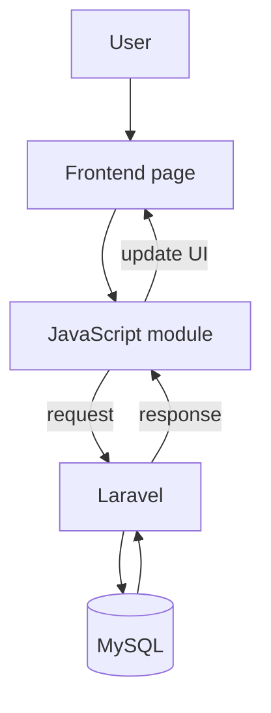
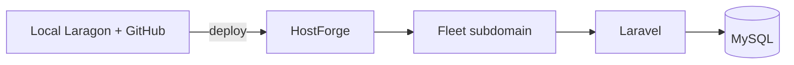

# Backend Integration

## Fleet & Transportation Management System

**Hospital Information Management System (HIMS)**  
Developer Documentation

---

## 1. Overview

This project is the **Fleet & Transportation Management** frontend for a Hospital Information Management System.

**What is already done**

- The user interface is finished (pages, design system, components, modules).
- Login, theme, navigation, and module screens work as a **frontend-only** demo.
- Data is mostly simulated (in-page sample data, browser storage where used).
- Authentication is a **frontend session simulation**, not real server security.

**What comes next**

- The backend will be built with **Laravel** and **MySQL**.
- Laravel will handle login, database, validation, roles, and real data.
- The **existing frontend design should stay the same**.
- Backend work should **connect** to the UI, not redesign it.

This guide explains how a backend developer can integrate Laravel with the current frontend without breaking the screens users already know.

---

## 2. Current Frontend Setup

The repository is a static multi-page frontend (HTML, CSS, Bootstrap, vanilla JavaScript). There is no Laravel app in this folder yet.

### Pages

Each main screen is a folder with `index.html`:

| Page | Path |
| ---- | ---- |
| Entry redirect | `index.html` |
| Login | `login/index.html` |
| Dashboard | `dashboard/index.html` |
| Vehicles | `fleet/index.html` |
| Reservations | `reservation/index.html` |
| Dispatch | `dispatch/index.html` |
| Drivers | `driver/index.html` |
| Maintenance | `maintenance/index.html` |
| Fuel | `fuel/index.html` |
| Route Planning | `route-planning/index.html` |
| Cost Analysis | `cost-analysis/index.html` |
| Reports | `reports/index.html` |
| Profile | `profile/index.html` |
| Settings | `settings/index.html` |

### Components

Reusable HTML pieces live under `components/`:

- **Shared shell:** `components/shared/sidebar.html`, `navbar.html`, `toast.html`
- **Module modals:** add / view / edit / delete under `components/vehicle/`, `reservation/`, `dispatch/`, `driver/`, `maintenance/`, `fuel/`

Pages load these through `assets/js/core/include.js` (using `fetch`).

### JavaScript

| Area | Location |
| ---- | -------- |
| Core (auth, theme boot, shell, toast) | `assets/js/core/` |
| Login page script | `assets/js/auth/login.js` |
| Shared UI behavior | `assets/js/components/` (navbar, export dropdown) |
| Module logic | `assets/js/<module>/` (example: `vehicle/` for the Vehicles page) |

### Assets

| Area | Location |
| ---- | -------- |
| CSS design system | `assets/css/` (`style.css` imports base, components, pages) |
| Images / branding | `assets/images/` |

### Shared layout and navigation

Protected pages use:

1. Sidebar (main menu)  
2. Navbar (search and utility icons)  
3. Main content for that module  
4. Toast host for messages  

The sidebar defines navigation between modules. Login has **no** sidebar or navbar.

More detail: [docs/03-FOLDER-STRUCTURE.md](./03-FOLDER-STRUCTURE.md), [docs/06-COMPONENT-SYSTEM.md](./06-COMPONENT-SYSTEM.md), [docs/08-ROUTING.md](./08-ROUTING.md).

---

## 3. Future Backend Setup

Laravel will become the **server** side of the system. It should provide:

| Backend responsibility | Meaning in simple terms |
| ---------------------- | ------------------------ |
| Authentication | Real login and logout |
| Sessions | Secure cookies after login |
| Business logic | Rules such as who can approve a reservation |
| Database | Store vehicles, drivers, trips, etc. in MySQL |
| Validation | Check data before saving |
| Authorization / roles | Who may open which page or action |
| Reports | Real totals and analytics from the database |
| API or web controllers | Receive requests from the browser and return results |

This document does **not** include Laravel code. It only describes how integration should work.

---

## 4. Frontend and Backend Responsibilities

| Frontend (keep) | Backend / Laravel (add) |
| --------------- | ------------------------ |
| Displays pages and layouts | Processes HTTP requests |
| Handles clicks, forms, and UI state | Validates all submitted data |
| Shows field errors and toasts | Stores and updates database records |
| Displays tables, cards, charts | Authenticates users |
| Applies light / dark / system theme | Authorizes actions by role |
| Client filters and pagination UX | Returns success or error responses |
| Shared components (sidebar, modals) | Generates real report data |
| Temporary demo data today | Becomes the source of truth for data |

**Rule of thumb:** the frontend shows and collects; Laravel decides and saves.

---

## 5. Data Flow

Today, many actions stay inside the browser. After integration, the flow should look like this:

**Example in plain language**

1. User opens Vehicles and clicks **Add Vehicle**.  
2. The modal form collects data (same UI as now).  
3. JavaScript sends the data to Laravel.  
4. Laravel checks the user is logged in and allowed to create vehicles.  
5. Laravel validates fields and saves to MySQL.  
6. Laravel returns success or errors.  
7. JavaScript shows a toast and refreshes the table.

Until Laravel is ready, the same UI can keep using demo data. Do not remove the demo behavior until the real endpoint works for that module.

---

## 6. API Integration

In general:

- JavaScript will **send requests** to Laravel (forms or `fetch` / similar).  
- Laravel will **return responses** (HTML redirect, JSON, or both—team choice).  
- Success responses should update the existing tables and toasts.  
- Validation errors should map to existing `.is-invalid` / field error messages.  

**This document does not invent endpoint URLs or write API code.**  
Communication expectations are documented in [docs/14-API-CONTRACT.md](./14-API-CONTRACT.md). Concrete endpoint paths can be added there when the team freezes routes.

Recommended approach for students:

1. Finish Laravel auth first.  
2. Pick **one** simple module (often Vehicles).  
3. Connect list + create only.  
4. Test the full UI path.  
5. Then edit, delete, and other modules.

---

## 7. Database Integration

Laravel will connect the frontend to **MySQL**.

- Tables will store vehicles, drivers, reservations, dispatches, maintenance, fuel, routes, users, settings, and related data.  
- Exact table designs belong in the next documentation step (planned **Database Mapping**).  
- The frontend does not talk to MySQL directly—only Laravel should access the database.

---

## 8. Authentication Integration

### Current (frontend only)

- Login page: `login/index.html`  
- Session helper: `assets/js/core/auth.js`  
- Key: `himsFleetSession` in `sessionStorage` / `localStorage`  
- Demo credentials for local UI only  
- **Not secure** and not for production hospital data  

See [docs/09-AUTHENTICATION.md](./09-AUTHENTICATION.md).

### Future (Laravel)

| Topic | Direction |
| ----- | --------- |
| Package / style | **Laravel Breeze** (session authentication) |
| Login / logout | Server-side session cookie |
| Role checking | Laravel middleware and policies |
| Frontend role | Show the login form, errors, and redirects—**not** final security |

After Breeze works:

- Replace demo login with real users.  
- Protect every module route on the server.  
- Keep the current login look and logout placement in the profile menu if possible.

---

## 9. Module Integration

Each screen below is already built. Laravel will later supply real data and rules.

| Module | Frontend path | What Laravel will later do |
| ------ | ------------- | -------------------------- |
| Dashboard | `dashboard/` | Live counts and activity from the database |
| Vehicles | `fleet/` | Full vehicle CRUD and status |
| Reservations | `reservation/` | Bookings, approval rules, vehicle links |
| Dispatch | `dispatch/` | Trip assignment and status changes |
| Drivers | `driver/` | Driver records and availability |
| Maintenance | `maintenance/` | Work orders and costs |
| Fuel Management | `fuel/` | Fuel logs and cost data |
| Route Planning | `route-planning/` | Saved routes/templates; maps later if approved |
| Cost Analysis | `cost-analysis/` | Real cost totals and budgets |
| Reports | `reports/` | Server queries for charts and exports |
| Profile | `profile/` | Logged-in user profile |
| Settings | `settings/` | Saved fleet unit preferences |

Suggested order (same as the start-here guide): **Auth → Profile/roles → Vehicles & Drivers → Reservations & Dispatch → Maintenance & Fuel → Routes → Cost & Reports → Settings**.

Details per module: [docs/11-MODULES.md](./11-MODULES.md).

---

## 10. Deployment Overview

### Development

| Tool | Typical use |
| ---- | ----------- |
| Laragon (or similar local stack) | Run PHP, Laravel, MySQL locally |
| GitHub | Source control and collaboration |
| Local static server | View this frontend alone (for UI work) |

### Production (approved direction)

| Piece | Role |
| ----- | ---- |
| School HostForge environment | Hosting platform for the project |
| Fleet subdomain | Example shape: `fleet.<school-domain>` (exact name from school/HostForge) |
| Laravel | Application server |
| MySQL | Database |

The Fleet module is meant to be deployed under the **school-provided HostForge** environment as its own Fleet-facing application surface. Exact hostnames are set in deployment config, not hard-coded in this frontend repo.

---

## 11. Best Practices

1. **Keep the frontend UI unchanged** unless a real bug or approved design change exists.  
2. **Reuse existing JavaScript modules**—turn data loading into API calls instead of rewriting pages.  
3. **Validate every request in Laravel**, even if the browser already checks the form.  
4. **Keep business rules in Laravel** (approvals, permissions, totals).  
5. **Reuse shared components** (sidebar, modals, toasts, tables).  
6. **Do not trust client-only “login”** after go-live.  
7. **Integrate one module at a time** and test after each step.  
8. **Do not delete demo fallbacks** until the real backend path works.  
9. **Document new routes and tables** when you add them.  
10. **Never put database passwords or secrets in frontend JavaScript.**

---

## 12. Related Documents

| Document | What it helps with |
| -------- | ------------------ |
| [docs/00-START-HERE.md](./00-START-HERE.md) | First steps for developers |
| [docs/01-PROJECT-OVERVIEW.md](./01-PROJECT-OVERVIEW.md) | What the project is about |
| [docs/02-TECH-STACK.md](./02-TECH-STACK.md) | Technologies used |
| [docs/03-FOLDER-STRUCTURE.md](./03-FOLDER-STRUCTURE.md) | Frozen folder layout |
| [docs/04-PROJECT-ARCHITECTURE.md](./04-PROJECT-ARCHITECTURE.md) | Overall architecture |
| [docs/07-JAVASCRIPT-ARCHITECTURE.md](./07-JAVASCRIPT-ARCHITECTURE.md) | How JS is organized |
| [docs/08-ROUTING.md](./08-ROUTING.md) | Pages and navigation |
| [docs/09-AUTHENTICATION.md](./09-AUTHENTICATION.md) | Login and sessions |
| [docs/10-THEME-SYSTEM.md](./10-THEME-SYSTEM.md) | Light / dark / system theme |
| [docs/11-MODULES.md](./11-MODULES.md) | Each module explained |
| [docs/12-BACKEND-INTEGRATION.md](./12-BACKEND-INTEGRATION.md) | This guide |
| [docs/13-DATABASE-MAPPING.md](./13-DATABASE-MAPPING.md) | Tables and fields guide |
| [docs/14-API-CONTRACT.md](./14-API-CONTRACT.md) | Frontend–backend communication guide |
| [docs/21-ROLE-MATRIX.md](./21-ROLE-MATRIX.md) | Roles and permissions |
| [docs/22-DEPLOYMENT-ARCHITECTURE.md](./22-DEPLOYMENT-ARCHITECTURE.md) | Deployment architecture |
| [docs/23-HOSTING-INFRASTRUCTURE.md](./23-HOSTING-INFRASTRUCTURE.md) | Hosting infrastructure |

---

## 13. Conclusion

The current Fleet frontend is complete as a presentation layer. It was built so Laravel can be added underneath without changing the look and feel of the system.

Backend work should focus on real authentication, MySQL storage, validation, roles, and reliable data for each module—while the existing pages, components, and design system stay in place.

Connect one piece at a time, test with the real UI, and keep the user experience consistent.

---

## Document control

| Field | Value |
| ----- | ----- |
| Path | `docs/12-BACKEND-INTEGRATION.md` |
| Type | Backend integration guide |
| Audience | BSIT students, Laravel integrators, advisers |
| Production code changes | None |
