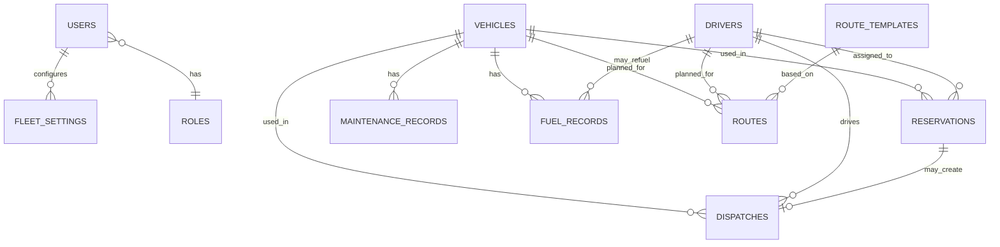

# Database Mapping

## Fleet & Transportation Management System

**Hospital Information Management System (HIMS)**  
Developer Documentation

---

## 1. Overview

**Purpose of this document**

This guide explains what data the finished Fleet frontend needs, and how that data can map to a future **MySQL** database under **Laravel**.

**Current situation**

- The frontend has **no real database**.
- Screens use demo rows, in-page data, and some browser storage.
- Login is a frontend simulation only.

**What comes next**

- Laravel + MySQL will store real records.
- This document is a **planning guide** for backend students—not SQL or migrations.

Use it when designing tables and models. Field lists are based on what the UI already collects or displays. Exact column names can still be refined during implementation.

---

## 2. Database Overview

| Item | Choice |
| ---- | ------ |
| Backend framework | Laravel |
| Database | MySQL |
| Local development | Laragon (or similar) |
| Production hosting | School HostForge environment |
| App surface | Fleet subdomain (see routing docs) |

Laravel will talk to MySQL. The browser will talk to Laravel only—not directly to the database.

---

## 3. Module and Database Mapping

Implemented frontend modules and the main data they need:

| Module | Main data | Future table (suggested) | Purpose |
| ------ | --------- | ------------------------ | ------- |
| Dashboard | Counts and recent activity | *(reads other tables)* | Show live summary numbers |
| Vehicles | Fleet vehicles | `vehicles` | Inventory and status |
| Reservations | Transport requests | `reservations` | Book vehicles/trips |
| Dispatch | Assigned trips | `dispatches` | Run and track trips |
| Drivers | Driver roster | `drivers` | People who drive vehicles |
| Maintenance | Service records | `maintenance_records` | Repair and service history |
| Fuel Management | Refuel logs | `fuel_records` | Fuel quantity and cost |
| Route Planning | Planned routes | `routes`, `route_templates` | Plan paths before dispatch |
| Cost Analysis | Costs and budgets | `cost_budgets` (+ queries) | Analyze spending |
| Reports | Analytics views | *(queries + optional `report_presets`)* | Management reports |
| Profile / login users | Accounts | `users` | Who can sign in |
| Settings | Unit preferences | `fleet_settings` | System configuration |
| Roles (future auth) | Access control | `roles` (+ pivot) | Who can do what |

Table names are **suggestions** for the backend team. They are not created in this repository.

---

## 4. Suggested Tables

No SQL and no migrations here—only guidance from the UI.

### 4.1 `vehicles`

**Purpose:** Store each hospital vehicle shown on `fleet/index.html`.

**Example fields (from Add Vehicle UI)**

- Plate number  
- Type  
- Capacity  
- Assigned driver (link to drivers)  
- Fuel type  
- Mileage  
- Status (available, on trip, maintenance, etc.)  
- Purchase date  
- Insurance expiry  
- Notes  
- Image path (optional)  

**Relationships**

- May belong to one assigned driver  
- Has many reservations, dispatches, maintenance records, fuel records, routes  

---

### 4.2 `drivers`

**Purpose:** Driver list on `driver/index.html`.

**Example fields**

- Full name  
- Employee ID  
- License number, class, expiry  
- Phone, email  
- Assigned vehicle (link to vehicles)  
- Experience (years)  
- Status  
- Address  
- Emergency contact  
- Notes  
- Photo path (optional)  

**Relationships**

- May link to one assigned vehicle  
- Appears on reservations and dispatches  
- Optional future link to a `users` account  

---

### 4.3 `reservations`

**Purpose:** Booking requests on `reservation/index.html`.

**Example fields**

- Reservation number  
- Patient name  
- Request type  
- Vehicle (required in UI)  
- Driver (required in UI)  
- Pickup location  
- Destination  
- Schedule date and time  
- Priority  
- Status (pending, approved, scheduled, completed, cancelled, rejected, etc.)  
- Contact number  
- Notes  

**Relationships**

- Belongs to vehicle  
- Belongs to driver  
- May lead to one or more dispatches  

---

### 4.4 `dispatches`

**Purpose:** Active trip coordination on `dispatch/index.html`.

**Example fields**

- Dispatch number  
- Linked reservation (optional/required as designed)  
- Patient name  
- Request type  
- Vehicle  
- Driver  
- Pickup and destination  
- Schedule date and time  
- Priority  
- Status  
- Contact  
- Notes  

**Relationships**

- Often linked to a reservation  
- Belongs to vehicle and driver  

---

### 4.5 `maintenance_records`

**Purpose:** Service history on `maintenance/index.html`.

**Example fields**

- Maintenance number  
- Vehicle  
- Service type  
- Technician / workshop  
- Scheduled date  
- Completion date  
- Cost  
- Priority  
- Status  
- Odometer  
- Description  
- Parts used  
- Notes  

**Relationships**

- Belongs to vehicle  
- Cost data can feed Cost Analysis and Reports  

---

### 4.6 `fuel_records`

**Purpose:** Refueling logs on `fuel/index.html`.

**Example fields**

- Fuel record number  
- Refuel date and time  
- Vehicle  
- Plate (can be copied from vehicle)  
- Driver name (UI currently text; backend may use driver id)  
- Fuel type  
- Quantity (liters)  
- Cost per liter  
- Total cost  
- Odometer  
- Station  
- Receipt / reference  
- Payment method  
- Notes  

**Relationships**

- Belongs to vehicle  
- Prefer foreign key to drivers when possible  
- Costs feed analytics  

---

### 4.7 `routes` and `route_templates`

**Purpose:** Route Planning page (`route-planning/index.html`). Frontend currently stores similar data in browser keys such as `himsFleetRoutes` and `himsFleetRouteTemplates`.

**Example route fields**

- Name / code  
- Origin  
- Destination  
- Stops (list or related `route_stops` table)  
- Priority, status  
- Vehicle, driver, department (as used in filters/UI)  
- Departure date  
- Distance, ETA, strategy (shown in map preview labels)  
- Notes  

**Example template fields**

- Template name  
- Default origin/destination/stops  
- Reusable planning defaults  

**Relationships**

- Route may reference vehicle and driver  
- Templates are reusable route blueprints  
- Map display is still a **placeholder** in the UI (no live Google Maps table required until maps are integrated)  

---

### 4.8 Cost analysis support

**Purpose:** Support `cost-analysis/index.html` (filters, charts, budgets, presets).

**Suggested data approach**

- Prefer **computed costs** from `fuel_records` and `maintenance_records` (and trip-related costs if added later).  
- Optional tables:  
  - `cost_budgets` — budget amount, period, category/department scope  
  - `cost_analysis_presets` — saved filter views (frontend key today: `himsFleetCostAnalysisPresets`)  

Avoid storing the same cost twice in many places.

---

### 4.9 Reports support

**Purpose:** Support `reports/index.html`.

**Suggested data approach**

- Most report data comes from **queries** across vehicles, drivers, reservations, dispatches, maintenance, and fuel.  
- Optional: `report_presets` for saved report views (frontend key today: `himsFleetReportPresets`).  

No separate “fake report data” table is required if operational tables are complete.

---

### 4.10 Dashboard

**Purpose:** `dashboard/index.html` overview.

**Suggested data approach**

- No dedicated “dashboard table.”  
- Use **counts and recent rows** from the operational tables.  

---

### 4.11 `users` (and profile)

**Purpose:** Real login (Laravel Breeze) and Profile page.

**Example fields**

- Name, email, password (hashed)  
- Role link  
- Phone / department (if needed)  
- Avatar path (optional)  
- Theme preference (optional; UI key today: `himsFleetTheme`)  

**Relationships**

- May link to a driver record for driver accounts  
- Owns settings or preferences as designed  

---

### 4.12 `fleet_settings`

**Purpose:** Settings page configuration (frontend key today: `himsFleetSettings`).

**Example content (flexible)**

- Hospital / fleet unit name  
- Driver-related defaults (e.g. license warning days)  
- Operational toggles shown in settings  
- JSON column is acceptable for flexible options  

Theme may stay on the user record or remain a simple preference field—keep one clear rule for the whole app.

---

## 5. Relationship Overview

Simple view of how main records connect:

**In words**

1. A **vehicle** can be reserved, dispatched, maintained, refueled, and used in routes.  
2. A **driver** can be assigned to reservations, dispatches, and routes.  
3. A **reservation** can become a **dispatch**.  
4. **Maintenance** and **fuel** hang off vehicles and feed cost/report numbers.  
5. **Users** and **roles** control who may use the system.

---

## 6. Shared Tables

These are not full “business modules” on their own, but backend projects usually need them:

| Suggested table | Purpose |
| --------------- | ------- |
| `users` | Login accounts (Laravel Breeze) |
| `roles` | Role names (Fleet Manager, Dispatcher, etc.) |
| `role_user` or similar | Links users to roles |
| `departments` | Optional: hospital units for filters and reservations |
| `notifications` | Optional: real alerts later (navbar is only UI today) |
| `activity_logs` / `audit_logs` | Optional: history of important changes |

Add shared tables only when a feature needs them. Keep the first version small if time is limited.

---

## 7. Audit and History

**Why audit logs help**

Hospitals need accountability. If a vehicle status changes or a reservation is approved, staff should be able to see **who did it and when**.

**Examples of actions worth logging**

- Vehicle create/update/delete  
- Reservation approval or rejection  
- Dispatch completion  
- Maintenance updates  
- User login / logout  
- Settings changes  

Laravel can write these to an `activity_logs` table later. This document does not implement logging.

---

## 8. Future Database Growth

New features can be added **without redesigning the whole frontend**:

1. Add a new MySQL table and Laravel model.  
2. Add controller/API or web routes.  
3. Point existing JS data loading to the new endpoint.  
4. Keep the same HTML layout and components.

Because pages are already modular (`fleet/`, `dispatch/`, etc.), new modules can follow the same pattern: page + components + JS folder + new tables.

---

## 9. Best Practices

1. Use a **primary key** on every table (`id`).  
2. Use **foreign keys** for vehicle_id, driver_id, reservation_id, etc.  
3. **Avoid duplicate data**—store cost once (e.g. in fuel/maintenance), then report with queries.  
4. **Validate in Laravel** even if the browser already checks the form.  
5. Keep relationships clear and documented.  
6. Use sensible statuses as enums or lookup values.  
7. Hash passwords; never store plain passwords.  
8. Plan indexes on foreign keys and common filters (status, dates).  
9. Start with core tables (users, vehicles, drivers, reservations, dispatches) before advanced analytics.  
10. Match UI fields first; do not invent large unused schemas.

---

## 10. Related Documentation

| Document | Use |
| -------- | --- |
| [docs/00-START-HERE.md](./00-START-HERE.md) | Project entry guide |
| [docs/03-FOLDER-STRUCTURE.md](./03-FOLDER-STRUCTURE.md) | Frontend folders |
| [docs/08-ROUTING.md](./08-ROUTING.md) | Pages and URLs |
| [docs/09-AUTHENTICATION.md](./09-AUTHENTICATION.md) | Login / sessions |
| [docs/11-MODULES.md](./11-MODULES.md) | Module features |
| [docs/12-BACKEND-INTEGRATION.md](./12-BACKEND-INTEGRATION.md) | How frontend meets Laravel |
| [docs/13-DATABASE-MAPPING.md](./13-DATABASE-MAPPING.md) | This document |
| `docs/14-API-CONTRACT.md` | Planned — request/response details |
| `docs/21-ROLE-MATRIX.md` | Planned — roles and permissions |

---

## 11. Conclusion

This document is a **map from the existing Fleet screens to a future MySQL design**.

It does not create the database. It helps the backend developer know which tables are needed, what fields the UI already uses, and how records relate—so Laravel models and migrations can be built with less guesswork.

Build the core operational tables first, connect them to the UI one module at a time, and grow reports and audit features after the basics work.

---

## Document control

| Field | Value |
| ----- | ----- |
| Path | `docs/13-DATABASE-MAPPING.md` |
| Type | Database mapping guide |
| SQL / migrations | None (documentation only) |
| Production code changes | None |
