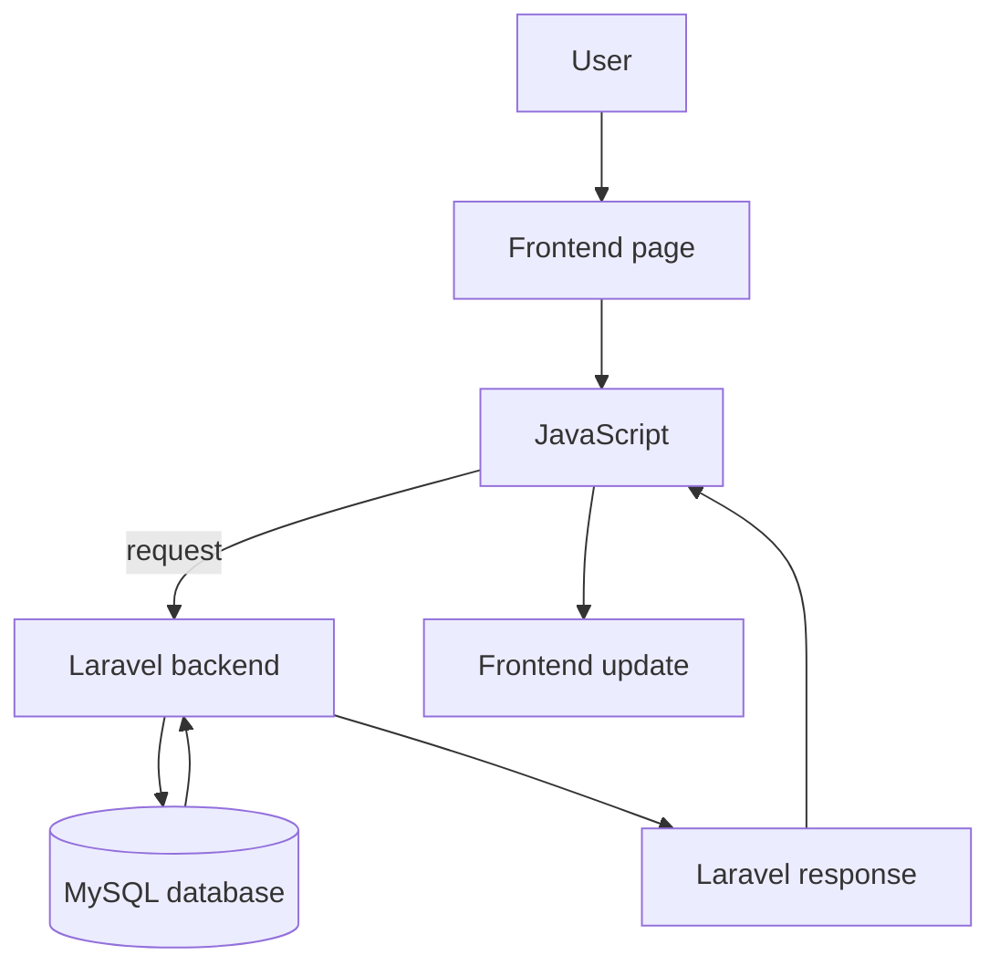

# Frontend and Backend Communication Guide

## Fleet & Transportation Management System

**Hospital Information Management System (HIMS)**  
Developer Documentation

---

## 1. Overview

**Purpose of this document**

This guide explains how the finished Fleet **frontend** and the future **Laravel backend** should talk to each other.

It is **not** a full API specification. It does not list final URLs or JSON bodies. Those details can be decided later when Laravel routes are built. This file only describes the **rules and expectations** so both sides stay aligned.

**Current situation**

- The frontend already has complete pages and modules.
- Most data is **sample / static / browser-local** (demo tables, localStorage where used).
- Authentication is a **frontend simulation**, not real server security.

**Future situation**

- Laravel + MySQL will supply **real data**.
- The **UI design should stay the same**.
- JavaScript modules should be updated to request data from Laravel instead of only using demo data.

Related reading: [docs/12-BACKEND-INTEGRATION.md](./12-BACKEND-INTEGRATION.md), [docs/11-MODULES.md](./11-MODULES.md), [docs/13-DATABASE-MAPPING.md](./13-DATABASE-MAPPING.md).

---

## 2. Communication Flow

**In simple steps**

1. The user uses a page (for example Vehicles).  
2. JavaScript handles the action (load list, save form, delete).  
3. The browser sends a request to Laravel.  
4. Laravel checks login, rights, and data.  
5. Laravel reads or writes MySQL.  
6. Laravel sends a response back.  
7. JavaScript updates the table, form, toast, or empty state.

---

## 3. Request and Response

Think of every action as four steps:

| Step | Who | What happens |
| ---- | --- | ------------ |
| 1. Request | Frontend JavaScript | Sends what the user wants (list data, create, update, delete, login, etc.) |
| 2. Process | Laravel | Checks session/role, validates input, applies business rules |
| 3. Response | Laravel | Returns success data or a clear error |
| 4. Update UI | Frontend JavaScript | Refreshes lists, closes modals, shows toast or field errors |

**This document does not include:**

- Final endpoint paths  
- Sample JSON payloads  
- Controller code  

Those belong in a later, more detailed API list once the team freezes routes.

**What “success” should do in the UI**

- Update the existing table or cards.  
- Show a success toast where the app already uses toasts.  
- Close or reset modals the way the module already does.

**What “failure” should do in the UI**

- Keep the user on the same screen when possible.  
- Show field errors or a toast (see Section 5).

---

## 4. Expected Data per Module

Only **implemented** frontend modules are listed. “Backend responsibility” is general—not a list of invented endpoints.

| Module | Data needed | Backend responsibility | Frontend responsibility |
| ------ | ----------- | ---------------------- | ----------------------- |
| Dashboard | KPI counts, recent activity, status summaries | Compute live numbers from the database | Show cards, charts/placeholders, navigation shortcuts |
| Vehicles | Vehicle list and form fields (plate, type, status, mileage, etc.) | Store and return vehicle records; enforce rules | List, search, filters, modals, pagination, export UI |
| Reservations | Reservation records (patient, vehicle, driver, schedule, status, etc.) | Save bookings; future approval rules | Reservation CRUD UI and status badges |
| Dispatch | Dispatch/trip records (assignment, schedule, status, priority, etc.) | Save trips; status transitions | Dispatch list, filters, modals, export UI |
| Drivers | Driver roster (name, license, contact, status, etc.) | Store driver records | Driver CRUD UI and stats |
| Maintenance | Service records (vehicle, type, dates, cost, status, etc.) | Store maintenance history and costs | Maintenance CRUD UI and stats |
| Fuel Management | Fuel logs (vehicle, quantity, costs, odometer, station, etc.) | Store fuel transactions | Fuel CRUD UI and stats |
| Route Planning | Routes and templates (origin, destination, stops, filters, meta) | Persist routes/templates | Route UI, filters, templates, map **placeholder** |
| Cost Analysis | Cost totals, trends, budgets, filter results | Aggregate costs; store budgets/presets if needed | Filters, charts, tables, export UI |
| Reports | Multi-view analytics datasets and optional saved presets | Query operational data for reports | Report views, charts, tables, export UI |
| Profile | Logged-in user profile fields | Return/update authenticated user | Profile form and sidebar identity display |
| Settings | Fleet unit preferences | Store unit/settings securely | Settings forms, import/export UI patterns |

Shared shell data (sidebar user name/role, theme preference) also needs backend support after real auth is added. Theme details: [docs/10-THEME-SYSTEM.md](./10-THEME-SYSTEM.md).

---

## 5. Error Handling

The frontend already has patterns for messages. Laravel responses should be easy to map into those patterns.

| Situation | What Laravel should do (general) | What the frontend should do |
| --------- | -------------------------------- | --------------------------- |
| Validation fails | Return clear field or form errors | Mark inputs (e.g. `.is-invalid`), show field error text, optional warning toast |
| No data found | Return an empty list or empty result (not a crash) | Show existing empty states / empty chart messages |
| Not logged in | Reject the request (unauthorized) | Send user to login (server redirect or client follow-up) |
| Not allowed (role) | Reject the request (forbidden) | Hide or disable actions in UI **and** show an error if requested anyway |
| Server error | Return a safe generic error | Error toast; keep page usable |
| Connection problem | Request never completes | Error toast / offline-style message; allow retry |

**Simple rule:** never trust only the browser. Always validate and authorize again in Laravel.

---

## 6. Loading States

Good loading feedback stops users from clicking twice or thinking the app is broken.

| State | Purpose | Where it already exists in the UI |
| ----- | ------- | ----------------------------------- |
| Loading | Show work in progress | Button busy/loading styles, skeleton CSS, disabled submit on login |
| Empty | Explain that there is nothing to show | Module empty states, chart empty messages |
| Success | Confirm the action worked | Success toasts |
| Error | Explain failure | Error toasts, field errors |

**Why this matters**

- Users understand wait time.  
- Empty results look intentional, not broken.  
- Success and error messages match the current design system.

When connecting Laravel, keep these states. Do not invent a totally new notification system.

---

## 7. File Uploads

Some screens already prepare for files in the UI:

| Possible upload | Related UI |
| --------------- | ---------- |
| Vehicle images | Vehicle add/edit image control |
| Driver photos | Driver add/edit image control |
| Documents | Future (receipts, attachments)—not fully specified yet |
| Generated reports | Export is client-side today; server files optional later |

**Laravel’s job later**

- Accept the file safely.  
- Validate type and size.  
- Store it (local disk or approved storage).  
- Return a path or URL the frontend can show.

Until uploads are wired, the UI may keep using placeholders (for example the vehicle placeholder image).

---

## 8. Authentication Requests

Authentication must move from the demo session to Laravel.

| Action | Who owns it | Frontend role |
| ------ | ----------- | ------------- |
| Login | Laravel (e.g. Breeze session auth) | Show login form and errors |
| Logout | Laravel session end | Profile menu logout control |
| Session checking | Laravel middleware / session | Optional soft redirect only for UX |
| Role verification | Laravel policies / middleware | Hide menus for convenience only |

Current frontend session key `himsFleetSession` is **temporary**. Details: [docs/09-AUTHENTICATION.md](./09-AUTHENTICATION.md).

**Important:** After go-live, “logged in” means the **server** says so—not only browser storage.

---

## 9. Best Practices

1. Keep response handling **consistent** across modules (success → refresh + toast; validation → field errors).  
2. **Validate in Laravel** on every write.  
3. **Do not trust frontend input** or hidden fields alone.  
4. **Reuse existing JavaScript** modules; change data sources, not whole pages.  
5. **Avoid changing the existing UI** layout and classes.  
6. Integrate **one module at a time**.  
7. Keep demo/sample fallbacks until the real path works.  
8. Never put database secrets in frontend code.  
9. Document real endpoints in a follow-up list when the team freezes them.  
10. Match errors and empty results to components already documented in the design/component system.

---

## 10. Related Documentation

| Document | Why it helps |
| -------- | ------------ |
| [docs/00-START-HERE.md](./00-START-HERE.md) | Start here for the whole project |
| [docs/07-JAVASCRIPT-ARCHITECTURE.md](./07-JAVASCRIPT-ARCHITECTURE.md) | How module scripts are organized |
| [docs/08-ROUTING.md](./08-ROUTING.md) | Pages and navigation |
| [docs/09-AUTHENTICATION.md](./09-AUTHENTICATION.md) | Login and sessions |
| [docs/11-MODULES.md](./11-MODULES.md) | What each module does |
| [docs/12-BACKEND-INTEGRATION.md](./12-BACKEND-INTEGRATION.md) | Overall backend plan |
| [docs/13-DATABASE-MAPPING.md](./13-DATABASE-MAPPING.md) | Tables and fields guide |
| [docs/14-API-CONTRACT.md](./14-API-CONTRACT.md) | This communication guide |
| `docs/21-ROLE-MATRIX.md` | Planned role permissions |

---

## 11. Conclusion

This guide helps frontend and backend developers work together using a **shared idea of requests, responses, errors, and module data**—without locking the team into invented endpoint lists too early.

The Fleet interface is already built. Laravel should feed it real, secure data while the current screens, components, and user experience stay in place.

---

## Document control

| Field | Value |
| ----- | ----- |
| Path | `docs/14-API-CONTRACT.md` |
| Type | Frontend–backend communication guide |
| Endpoint list | Not fixed in this document (on purpose) |
| Production code changes | None |
