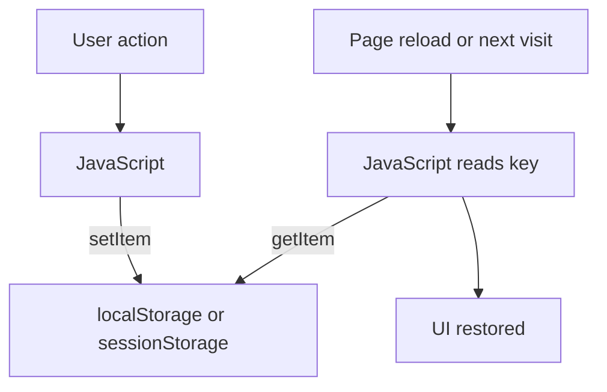

# Local Storage Guide

## Fleet & Transportation Management System

**Hospital Information Management System (HIMS)**  
Developer Documentation

---

## 1. Overview

**What is browser storage?**

Browsers can save small pieces of data on the user’s device using:

- **localStorage** — stays until cleared (or the site clears it)  
- **sessionStorage** — usually lasts only for that browser tab  

**Why the Fleet frontend uses it now**

- There is **no Laravel/MySQL backend** in this repository yet.  
- Storage helps keep some UI choices and demo data after refresh.  
- Examples: theme preference, temporary login session, settings, route data.

**Why Laravel will replace most of it later**

- Important hospital data must live in a **real database**.  
- Login must use a **secure server session**, not only browser JSON.  
- Many modules should load from **MySQL through Laravel**, not from localStorage.

Browser storage can still be useful for lightweight UI preferences (such as theme) after backend integration.

---

## 2. Current Usage

The following keys were found in the repository. **Only these verified keys** are documented.

### Authentication

| Key | Storage | Where used | What it holds (summary) |
| --- | ------- | ---------- | ------------------------ |
| `himsFleetSession` | `sessionStorage` or `localStorage` | `auth.js`, `auth-boot.js`, root `index.html` | Frontend login simulation: `authenticated`, `user`, `email`, `loginTime`, `remember` — **no password** |

- **Remember me** checked → saved in `localStorage`  
- **Remember me** unchecked → saved in `sessionStorage`  
- Logout removes this key only  

### Theme and shell UI

| Key | Storage | Where used | What it holds |
| --- | ------- | ---------- | ------------- |
| `himsFleetTheme` | `localStorage` | `theme-boot.js`, `main.js`, settings | Preference: `light`, `dark`, or `system` |
| `himsFleetSidebarCollapsed` | `localStorage` | `main.js` | Desktop sidebar collapsed preference (`true` / `false` string) |

### Profile and settings

| Key | Storage | Where used | What it holds |
| --- | ------- | ---------- | ------------- |
| `himsFleetUserProfile` | `localStorage` | `user-profile.js` | Name, role, and related profile fields for UI |
| `himsFleetSettings` | `localStorage` | `settings-store.js` | Fleet settings JSON (theme is **not** stored here; theme uses `himsFleetTheme`) |

### Cross-page helper

| Key | Storage | Where used | What it holds |
| --- | ------- | ---------- | ------------- |
| `himsFleetPendingAction` | `sessionStorage` | `pending-action.js` | Short-lived action payload when navigating between pages (expires after about 60 seconds) |

### Route planning

| Key | Storage | Where used | What it holds |
| --- | ------- | ---------- | ------------- |
| `himsFleetRoutes` | `localStorage` | `route-store.js` | Saved routes for the Route Planning page |
| `himsFleetRouteTemplates` | `localStorage` | `route-store.js` | Route templates |

### Cost analysis

| Key | Storage | Where used | What it holds |
| --- | ------- | ---------- | ------------- |
| `himsFleetCostAnalysisBudget` | `localStorage` | `cost-budget.js` | Budget configuration |
| `himsFleetCostAnalysisBudgetHistory` | `localStorage` | `cost-budget.js` | Budget history |
| `himsFleetCostAnalysisPresets` | `localStorage` | `cost-presets.js` | Saved cost analysis filter presets |

### Reports

| Key | Storage | Where used | What it holds |
| --- | ------- | ---------- | ------------- |
| `himsFleetReportPresets` | `localStorage` | `reports-presets.js` | Saved report view presets |

### Optional operational keys (read if present)

These keys are **read** by reports, cost analysis, and/or navbar search helpers. They are not the only way modules show data (many lists also use in-page demo rows).

| Key | Storage | Example readers |
| --- | ------- | --------------- |
| `himsFleetVehicles` | `localStorage` | `reports-data.js`, `cost-data.js`, `navbar.js` |
| `himsFleetDrivers` | `localStorage` | `reports-data.js`, `navbar.js` |
| `himsFleetReservations` | `localStorage` | `reports-data.js`, `cost-data.js`, `navbar.js` |
| `himsFleetDispatches` | `localStorage` | `reports-data.js`, `cost-data.js`, `navbar.js` |
| `himsFleetMaintenance` | `localStorage` | `reports-data.js`, `cost-data.js` |
| `himsFleetFuel` | `localStorage` | `reports-data.js`, `cost-data.js` |

**Note:** Passwords must never be stored in browser storage. The current auth code does not save passwords.

---

## 3. Current Data Flow

**Example: theme**

1. User picks Dark in Appearance.  
2. `applyTheme("dark")` saves `himsFleetTheme` = `dark`.  
3. On next page load, `theme-boot.js` reads the key and sets `data-theme`.  

**Example: demo login**

1. User signs in with demo credentials.  
2. `login()` writes `himsFleetSession`.  
3. `auth-boot.js` checks that key on protected pages.  
4. Logout deletes only that session key.

---

## 4. Future Laravel Replacement

| Kind of data | Keep in browser? | Future source |
| ------------ | ---------------- | ------------- |
| Theme preference | Optional cache of last choice | User preference in database / profile (Laravel) |
| Sidebar collapsed | Yes, OK as UI-only | Optional server sync later |
| Login session | **No** as authority | Laravel session cookie (Breeze) |
| User profile | Temporary only | Authenticated user record |
| Fleet settings | Temporary only | `fleet_settings` (or similar) in MySQL |
| Routes / templates | Temporary only | Database tables |
| Cost budgets / presets | Temporary only | Database |
| Report presets | Temporary only | Database |
| Vehicles, drivers, reservations, dispatch, maintenance, fuel | Should not be system of record in browser | MySQL via Laravel |
| Reports / dashboard numbers | Sample/static today | Live queries from MySQL |
| Pending action helper | Can stay client-only or become normal routes | Product choice |

**Simple rule**

- **UI comfort** (theme, sidebar open/closed) may stay light in the browser.  
- **Business records and real login** must move to Laravel + MySQL.

---

## 5. Responsibilities

| Information | Current location | Future location |
| ----------- | ---------------- | --------------- |
| Theme preference | `localStorage` → `himsFleetTheme` | Database user preference (+ optional local cache) |
| Frontend login session | `sessionStorage` / `localStorage` → `himsFleetSession` | Laravel session (server + cookie) |
| User profile | `localStorage` → `himsFleetUserProfile` | `users` table / auth user |
| Fleet settings | `localStorage` → `himsFleetSettings` | MySQL settings record |
| Sidebar collapsed | `localStorage` → `himsFleetSidebarCollapsed` | Browser UI preference (fine to keep) |
| Pending navigation action | `sessionStorage` → `himsFleetPendingAction` | Optional; may stay client helper |
| Routes | `localStorage` → `himsFleetRoutes` | MySQL routes |
| Route templates | `localStorage` → `himsFleetRouteTemplates` | MySQL templates |
| Cost budgets / history / presets | `localStorage` cost keys | MySQL |
| Report presets | `localStorage` → `himsFleetReportPresets` | MySQL |
| Vehicle / driver / reservation / dispatch / maintenance / fuel lists | Often in-page demo data; optional localStorage keys above | MySQL tables |
| Dashboard / report metrics | Static or computed from samples | Laravel queries |

---

## 6. Best Practices

1. Store **only what you need** in the browser.  
2. **Never store passwords** or database secrets.  
3. Treat browser data as **temporary**, not the hospital system of record.  
4. **Clear invalid JSON** safely (the code already catches parse errors in several places).  
5. On logout, clear **auth session** only unless the product requires a full wipe.  
6. Use Laravel for **important records** (vehicles, trips, fuel, users).  
7. Keep browser storage **lightweight**.  
8. When APIs work, **stop writing** operational data to localStorage.  
9. Document any **new key** in this file if one is added later.  
10. Prefer one key per concern (do not split theme into multiple keys).

---

## 7. Related Documentation

| Document | Topic |
| -------- | ----- |
| [docs/00-START-HERE.md](./00-START-HERE.md) | Project start guide |
| [docs/07-JAVASCRIPT-ARCHITECTURE.md](./07-JAVASCRIPT-ARCHITECTURE.md) | Where storage is used in JS |
| [docs/09-AUTHENTICATION.md](./09-AUTHENTICATION.md) | Session simulation details |
| [docs/10-THEME-SYSTEM.md](./10-THEME-SYSTEM.md) | Theme key and apply flow |
| [docs/12-BACKEND-INTEGRATION.md](./12-BACKEND-INTEGRATION.md) | Connecting Laravel |
| [docs/13-DATABASE-MAPPING.md](./13-DATABASE-MAPPING.md) | Future MySQL tables |
| [docs/14-API-CONTRACT.md](./14-API-CONTRACT.md) | Frontend–backend communication |
| [docs/15-LOCAL-STORAGE.md](./15-LOCAL-STORAGE.md) | This guide |

---

## 8. Conclusion

Browser storage helped finish and demo the Fleet frontend without a database. It is a **temporary development tool**, not the final place for hospital fleet data.

When Laravel and MySQL are ready, real login, vehicles, trips, fuel, reports, and settings should come from the **server**. The browser can keep only light preferences—such as theme—so the app still feels fast and familiar.

---

## Document control

| Field | Value |
| ----- | ----- |
| Path | `docs/15-LOCAL-STORAGE.md` |
| Type | Local / session storage guide |
| Production code changes | None |
| Storage behavior changes | None |
