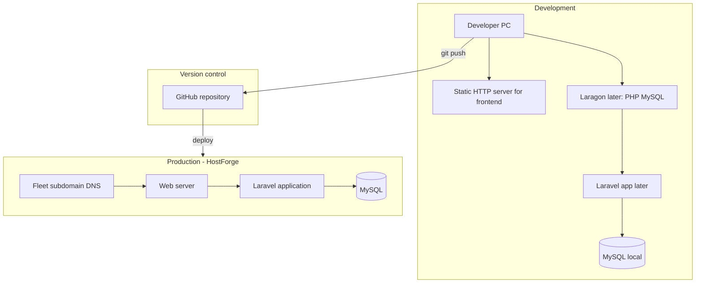
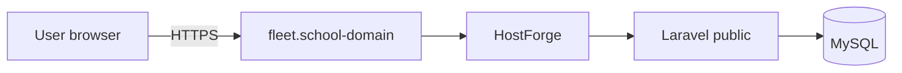

# Deployment Architecture

## Fleet & Transportation Management System

**Hospital Information Management System (HIMS)**  
Developer Documentation

---

## 1. Overview

This document describes how the Fleet module is expected to run in **development** and **production**.

| Current state | Future state |
| ------------- | ------------ |
| Frontend is a static multi-page app in this repository | Laravel + MySQL serve real data and authentication |
| Can be previewed on a local HTTP server | Deployed on school **HostForge** under a Fleet **subdomain** |
| No production secrets in the frontend | Environment variables and secure cookies on the server |

**Goals**

- Keep the same UI after backend integration.  
- Use a clear path from local work → GitHub → HostForge.  
- Avoid inventing hostnames; use school-provided values when available.

Related: [docs/12-BACKEND-INTEGRATION.md](./12-BACKEND-INTEGRATION.md), [docs/08-ROUTING.md](./08-ROUTING.md), [docs/20-HANDOVER-CHECKLIST.md](./20-HANDOVER-CHECKLIST.md).

---

## 2. High-Level Architecture

**In simple terms**

1. You build and test on your computer.  
2. You push code to GitHub.  
3. Production runs on HostForge with Laravel and MySQL.  
4. Users open the Fleet subdomain in a browser over HTTPS when configured.

---

## 3. Development Environment

### 3.1 Frontend-only (this repository today)

| Item | Detail |
| ---- | ------ |
| What you need | Browser + local HTTP server |
| Project root | `Fleet-Transportation-Frontend-Starter` |
| How to open | Serve root, then open `login/index.html` or module paths |
| Why HTTP | `include.js` loads components with `fetch` (often fails on `file://`) |
| Build step | None required (no app `package.json` toolchain in this starter) |
| CDNs | Bootstrap, Phosphor Icons, Google Fonts, and export libs (xlsx/jsPDF) as used by pages |

Example local servers (any one is fine):

- VS Code / Cursor Live Server  
- `python -m http.server 8080` from the repo root  
- Other simple static servers  

### 3.2 Full stack later (Laravel + MySQL)

| Item | Detail |
| ---- | ------ |
| Recommended local stack | **Laragon** (or similar: PHP, Composer, MySQL, web server) |
| Application | Laravel project (created during backend phase) |
| Database | Local MySQL database |
| Auth | Laravel Breeze session authentication (planned) |
| Config | `.env` for local DB and `APP_KEY` |

Frontend files from this repo can be served by Laravel (public assets / Blade views) later without redesigning the UI.

### 3.3 Version control

| Item | Detail |
| ---- | ------ |
| Tool | Git |
| Remote | GitHub |
| Practice | Pull → change → test → commit → push |

Do not commit secrets (production passwords, real `.env` with live credentials).

---

## 4. Production Environment

### 4.1 Hosting platform

| Item | Detail |
| ---- | ------ |
| Platform | School-provided **HostForge** |
| Application | Laravel + MySQL |
| Public entry | Fleet **subdomain** |

### 4.2 Domain placeholders

Exact hostnames come from the school / HostForge panel. Use placeholders until assigned:

| Role | Placeholder |
| ---- | ----------- |
| Main HIMS (if separate) | `https://app.<school-domain>` |
| Fleet module | `https://fleet.<school-domain>` |

Do not hard-code invented production domains in frontend source.

### 4.3 Production components

| Component | Responsibility |
| --------- | -------------- |
| DNS / subdomain | Points user traffic to HostForge |
| Web server | Serves Laravel’s public entry point |
| Laravel | Auth, validation, business rules, pages/API |
| MySQL | Persistent fleet data |
| HTTPS / SSL | Encrypts login and session traffic |
| Environment config | Database credentials, app key, debug flags |

---

## 5. Deployment Workflow

Recommended sequence:

| Step | Action |
| ---- | ------ |
| 1 | Develop and test locally |
| 2 | Commit and push to GitHub |
| 3 | Prepare production `.env` on HostForge (not in git) |
| 4 | Deploy application files / pull on server as school process allows |
| 5 | Run migrations / seeders when Laravel is ready |
| 6 | Point document root to Laravel `public` |
| 7 | Enable SSL if required |
| 8 | Smoke-test login and one full module CRUD path |
| 9 | Keep `APP_DEBUG=false` on real production |

**Frontend-only demos** can be published as static files only for UI review, but that is **not** the secure production architecture. Production Fleet should run with Laravel authentication and MySQL.

---

## 6. Environment Configuration

When Laravel exists, typical environment concerns include:

| Setting area | Development | Production |
| ------------ | ----------- | ---------- |
| `APP_ENV` | `local` | `production` |
| `APP_DEBUG` | often `true` | must be `false` |
| `APP_URL` | local URL | Fleet subdomain URL |
| Database | local MySQL | HostForge MySQL |
| Session / cookies | HTTP localhost OK for demo | Prefer HTTPS + secure cookies |
| Logging | local `storage/logs` | server logs; limited public errors |

**Never commit** live database passwords or private keys to GitHub.

---

## 7. Application Layers in Deployment

| Layer | What deploys | Notes |
| ----- | ------------ | ----- |
| Presentation | HTML/CSS/JS (this frontend) | Keep frozen structure and design system |
| Application | Laravel | Controllers, auth, validation |
| Data | MySQL | Tables from database mapping guide |
| Shared assets | Images, CSS, JS under `assets/` or public equivalents | Preserve relative path strategy or map carefully |

Path ownership remains as frozen in [docs/03-FOLDER-STRUCTURE.md](./03-FOLDER-STRUCTURE.md). Changing public URLs is a documented breaking change.

---

## 8. Authentication in Deployment

| Environment | Auth behavior |
| ----------- | ------------- |
| Current frontend repo | Demo session (`himsFleetSession`) — not production security |
| Local Laravel | Breeze login against local users table |
| HostForge production | Breeze (or approved session auth) with HTTPS and secure cookies |

Frontend keeps login UI presentation. Server owns credential checks and sessions.  
Details: [docs/09-AUTHENTICATION.md](./09-AUTHENTICATION.md).

---

## 9. Security Checklist for Production

- [ ] HTTPS enabled when available  
- [ ] `APP_DEBUG=false`  
- [ ] Strong `APP_KEY`  
- [ ] Database credentials only in server env  
- [ ] Real users—not demo frontend credentials  
- [ ] CSRF protection on web forms  
- [ ] Role checks enforced server-side ([docs/21-ROLE-MATRIX.md](./21-ROLE-MATRIX.md))  
- [ ] File upload validation if images are enabled  
- [ ] Regular backups of MySQL if school process allows  

---

## 10. Common Deployment Risks

| Risk | Prevention |
| ---- | ---------- |
| Deploying frontend demo as “secure production” | Require Laravel auth + DB before go-live claims |
| Wrong document root | Point to Laravel `public`, not project root with `.env` exposed |
| Broken asset paths | Test CSS/JS/images after deploy |
| Session issues on subdomain | Align cookie domain and HTTPS settings |
| DNS not ready | Confirm subdomain resolves before demos |
| Missing migrations | Run migrations before testing CRUD |
| Debug mode left on | Turn off in production env |

Troubleshooting help: [docs/19-TROUBLESHOOTING.md](./19-TROUBLESHOOTING.md).

---

## 11. Roles and Environments

| Role | Dev access | Production access (planned) |
| ---- | ---------- | --------------------------- |
| Developers | Local + GitHub | Deploy process per school rules |
| End users | N/A or demo UI | Fleet subdomain with real accounts |
| IT Admin role in app | Simulated later with seed users | Settings/config per role matrix |

---

## 12. Related Documentation

| Document | Topic |
| -------- | ----- |
| [docs/00-START-HERE.md](./00-START-HERE.md) | How to run the frontend locally |
| [docs/02-TECH-STACK.md](./02-TECH-STACK.md) | Technologies |
| [docs/08-ROUTING.md](./08-ROUTING.md) | Subdomain routing concept |
| [docs/09-AUTHENTICATION.md](./09-AUTHENTICATION.md) | Auth and HostForge session notes |
| [docs/12-BACKEND-INTEGRATION.md](./12-BACKEND-INTEGRATION.md) | Backend connection plan |
| [docs/13-DATABASE-MAPPING.md](./13-DATABASE-MAPPING.md) | MySQL mapping |
| [docs/18-KNOWN-LIMITATIONS.md](./18-KNOWN-LIMITATIONS.md) | What is not production-ready yet |
| [docs/19-TROUBLESHOOTING.md](./19-TROUBLESHOOTING.md) | Deploy and local fixes |
| [docs/20-HANDOVER-CHECKLIST.md](./20-HANDOVER-CHECKLIST.md) | Pre-deploy checklist |
| [docs/22-DEPLOYMENT-ARCHITECTURE.md](./22-DEPLOYMENT-ARCHITECTURE.md) | This document |

---

## 13. Conclusion

The Fleet project is developed locally, stored on GitHub, and planned for production on **HostForge** under a **Fleet subdomain**, with **Laravel** and **MySQL** as the real application stack.

Keep the frontend presentation stable, configure environments carefully, and only call the system production-ready when authentication, database, and HTTPS/session settings are correctly deployed.

---

## Document control

| Field | Value |
| ----- | ----- |
| Path | `docs/22-DEPLOYMENT-ARCHITECTURE.md` |
| Type | Deployment architecture |
| Production code changes | None |
| Current repo contents | Frontend starter (no Laravel app in-tree) |
| Dev frontend | Local HTTP server |
| Dev full stack (planned) | Laragon + Laravel + MySQL |
| Production (planned) | HostForge + Fleet subdomain |
| Exact production hostname | Provided by school/HostForge (not invented here) |
