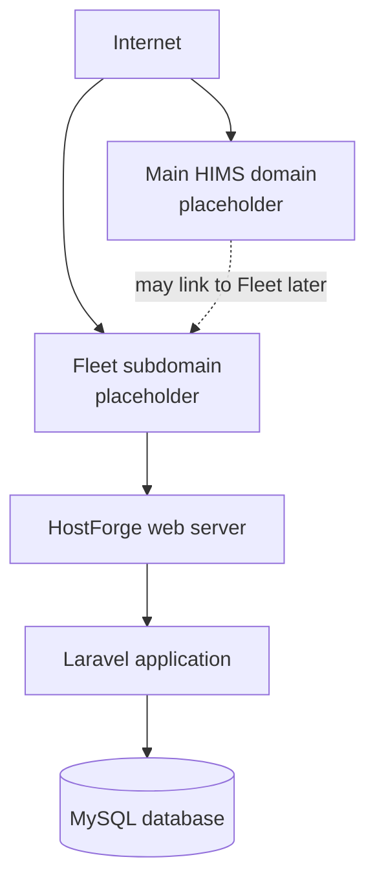
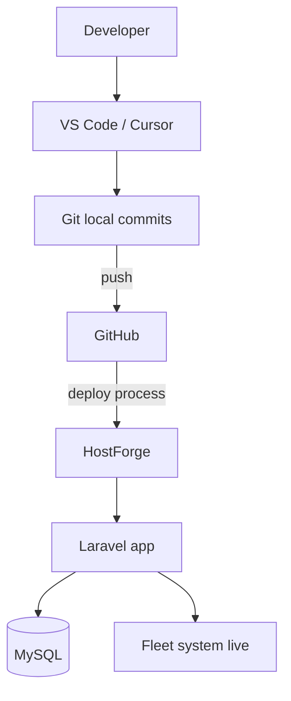

# Hosting Infrastructure

## Fleet & Transportation Management System

**Hospital Information Management System (HIMS)**  
Developer Documentation

---

## 1. Overview

**Purpose of this document**

This guide describes the **production hosting infrastructure** planned for the Fleet module: where the system runs, what major pieces are involved, and how developers should think about deploy and maintenance.

**Why hosting knowledge matters**

- Helps students prepare HostForge settings correctly.  
- Avoids confusion between local demo and real production.  
- Supports troubleshooting when the site is live.  
- Makes turnover clearer for the next developer.

**How this supports deployment and maintenance**

- Lists approved platforms only (no invented cloud vendors).  
- Separates development tools from production HostForge.  
- Points to related deployment, backend, and troubleshooting docs.

**Status note**

This repository is currently the **frontend starter**. Full production infrastructure (Laravel on HostForge) is the **approved target** for the completed system, not something already configured inside this static repo.

---

## 2. Hosting Environment

Approved production hosting for the Fleet project:

| Component | Approved choice |
| --------- | --------------- |
| Hosting platform | **HostForge** (school-provided) |
| Application framework | **Laravel** |
| Database | **MySQL** |
| Public access | **Fleet module subdomain** |
| Secure transport | **HTTPS / SSL** when enabled on HostForge |
| Source control | **GitHub** (code repository, not the live server itself) |

### Placeholders for hostnames

Exact domain names are assigned by the school / HostForge. Until then use:

| Item | Placeholder |
| ---- | ----------- |
| Main HIMS domain (if separate) | `https://app.<school-domain>` |
| Fleet subdomain | `https://fleet.<school-domain>` |

Do not invent production hostnames in application code.

---

## 3. Infrastructure Overview

| Component | Brief role |
| --------- | ---------- |
| **Internet** | Users reach the system through a browser |
| **Main HIMS domain** | Optional parent hospital system entry (future integration) |
| **Fleet subdomain** | Dedicated address for the Fleet module |
| **HostForge web server** | Receives HTTPS/HTTP requests and serves the app |
| **Laravel application** | Handles auth, pages/API, validation, business rules |
| **MySQL database** | Stores users, vehicles, trips, and other records |

Users primarily open the **Fleet subdomain**. The main HIMS domain may later link into Fleet; initial production login can remain independent (see authentication docs).

---

## 4. Development vs Production

| Item | Development | Production |
| ---- | ----------- | ---------- |
| **Purpose** | Build and test safely | Real (or school demo) use on HostForge |
| **Frontend preview** | Local HTTP server from repo root | Served via Laravel/HostForge public entry |
| **Full stack tools** | **Laragon** (PHP, Composer, MySQL, local web server) | **HostForge** managed hosting |
| **Application** | Local Laravel project (when backend phase starts) | Laravel on HostForge |
| **Database** | Local MySQL | HostForge MySQL |
| **Authentication** | Local Breeze sessions (planned); frontend demo only in this repo today | Server sessions + secure cookies |
| **Code storage** | Local Git | **GitHub** remote |
| **Deployment method** | Manual local runs | Deploy from GitHub / HostForge process (per school instructions) |
| **URL** | `http://localhost:...` | Fleet subdomain + SSL when enabled |
| **Debug mode** | Often on for learning | Must stay off for real production |

---

## 5. Server Components

Only the components in the approved architecture are listed.

### Web server

- Accepts browser requests for the Fleet host.  
- Should point the site document root to Laravel’s **`public`** directory (when Laravel is deployed).  
- Serves static assets (CSS, JS, images) and application routes.

### PHP / Laravel runtime

- Runs the Laravel application code.  
- Executes authentication, validation, controllers, and responses.  
- Uses configuration from environment variables (not committed secrets).

### MySQL database

- Persistent storage for fleet operational data and users.  
- Accessed only by Laravel (not directly from frontend JavaScript).  
- Credentials configured in the server environment.

### SSL certificate

- Enables **HTTPS** when HostForge/school SSL is enabled.  
- Protects login forms and session cookies in transit.  
- Required for secure cookie settings in production.

### Git repository (GitHub)

- Stores project source history.  
- Is **not** the live website by itself.  
- Developers push code; HostForge deployment uses the approved release process.

---

## 6. Deployment Flow

**Student-friendly steps**

1. Develop and test on your PC (frontend server and/or Laragon).  
2. Commit changes with clear messages.  
3. Push to GitHub.  
4. Deploy to HostForge following school instructions.  
5. Configure environment and database on the server.  
6. Confirm the Fleet subdomain opens the Laravel app.  
7. Test login and at least one full data path.

More detail: [docs/22-DEPLOYMENT-ARCHITECTURE.md](./22-DEPLOYMENT-ARCHITECTURE.md).

---

## 7. Security Considerations

| Practice | Why it matters |
| -------- | -------------- |
| **HTTPS** | Protects passwords and session cookies on the network |
| **Strong passwords** | HostForge, database, and admin accounts |
| **Environment variables** | Keep secrets out of GitHub and frontend JS |
| **Database protection** | DB not publicly writable; strong DB user permissions |
| **Regular backups** | Recover from mistakes or data loss |
| **Least privilege** | App DB user only needs required privileges; app roles follow Role Matrix |
| **`APP_DEBUG=false`** | Avoid exposing errors to the public |
| **Server authorization** | Laravel enforces roles; UI hiding is not enough |

---

## 8. Maintenance Guidelines

1. **Keep software updated** — PHP/Laravel/packages when the school environment allows.  
2. **Monitor server health** — site up, disk space, basic response checks.  
3. **Backup regularly** — database and critical files per HostForge tools or school policy.  
4. **Review logs** — Laravel logs and server error logs when something fails.  
5. **Update documentation** after infrastructure or domain changes.  
6. **Test after every deploy** — login + one CRUD path minimum.  
7. **Limit production access** to people who need it.  
8. **Record assigned hostnames** when the school provides them (update placeholders).

---

## 9. Related Documentation

| Document | Topic |
| -------- | ----- |
| [docs/22-DEPLOYMENT-ARCHITECTURE.md](./22-DEPLOYMENT-ARCHITECTURE.md) | Deployment architecture and workflow |
| [docs/12-BACKEND-INTEGRATION.md](./12-BACKEND-INTEGRATION.md) | How frontend connects to Laravel |
| [docs/19-TROUBLESHOOTING.md](./19-TROUBLESHOOTING.md) | Deploy and hosting problem fixes |
| [docs/21-ROLE-MATRIX.md](./21-ROLE-MATRIX.md) | Roles and access (server enforcement) |
| [docs/08-ROUTING.md](./08-ROUTING.md) | Subdomain routing concept |
| [docs/09-AUTHENTICATION.md](./09-AUTHENTICATION.md) | Sessions and production auth notes |
| [docs/18-KNOWN-LIMITATIONS.md](./18-KNOWN-LIMITATIONS.md) | What is not live yet |
| [docs/20-HANDOVER-CHECKLIST.md](./20-HANDOVER-CHECKLIST.md) | Pre-deploy verification |
| [docs/23-HOSTING-INFRASTRUCTURE.md](./23-HOSTING-INFRASTRUCTURE.md) | This document |

---

## 10. Conclusion

A clear hosting picture keeps deployment reliable and maintenance easier. For this project, production is **HostForge**, the app is **Laravel**, data is **MySQL**, and users reach Fleet through a **subdomain**, preferably over **HTTPS**.

Local work uses GitHub plus Laragon (for full stack) or a simple static server (for frontend UI). Document any school-assigned hostnames when you receive them, and keep secrets on the server—not in the repository.

---

## Document control

| Field | Value |
| ----- | ----- |
| Path | `docs/23-HOSTING-INFRASTRUCTURE.md` |
| Type | Hosting infrastructure guide |
| Production hosting | HostForge (school-provided) |
| App runtime | Laravel |
| Database | MySQL |
| Public entry | Fleet subdomain |
| Dev full stack | Laragon |
| Code remote | GitHub |
| Production code changes | None |
| Invented cloud providers | None |
